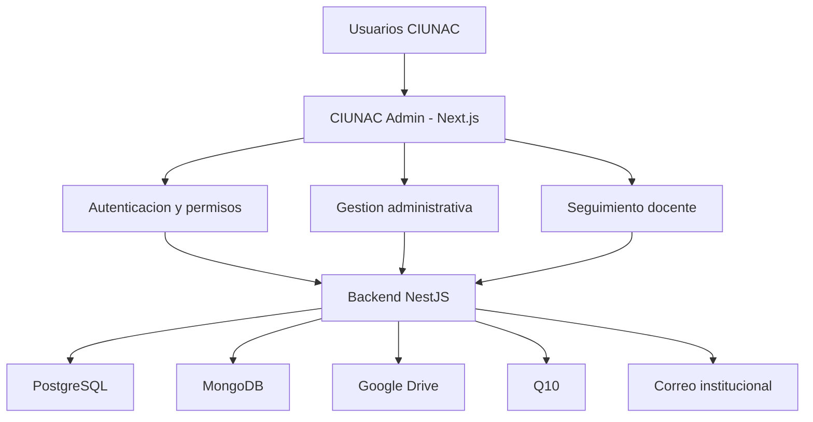
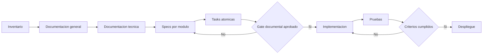

# 00 - Overview

## Estado del documento

- Estado: `DRAFT`
- Fuente: frontend `ciunac-admin-2` y backend `ciunac-backend-v1`
- Audiencia: producto, frontend, backend, QA y operaciones
- Regla: ningun elemento `TO-BE` se considera implementado hasta que el codigo y sus pruebas lo demuestren

## Producto

CIUNAC Admin centraliza operaciones academicas y administrativas del Centro de Idiomas de la Universidad Nacional del Callao. La aplicacion cubre autenticacion, usuarios, estructura academica, grupos, solicitudes, certificados, constancias, examenes de ubicacion y seguimiento docente.

## Lenguaje documental

| Marca | Significado |
| --- | --- |
| `AS-IS` | Comportamiento comprobado en el codigo actual |
| `GAP` | Inconsistencia, riesgo o cobertura incompleta |
| `TO-BE` | Comportamiento objetivo, aun no implementado |
| `DECISION` | Regla de producto que requiere aprobacion antes de implementar |

## Mapa funcional

## Modulos

| Codigo | Modulo | Rutas principales |
| --- | --- | --- |
| `AUTH` | Autenticacion | `/`, `/registro` |
| `DASH` | Dashboard | `/dashboard` |
| `USR` | Usuarios | `/usuarios` |
| `ESTR` | Estructura | `/estructura` |
| `GRP` | Grupos | `/grupos/*` |
| `SOL` | Solicitudes y pagos | `/solicitudes/*` |
| `CERT` | Certificados | `/certificados/*` |
| `CONS` | Constancias | `/constancias/*` |
| `EXU` | Examen de ubicacion | `/examen-ubicacion/*` |
| `SDOC` | Seguimiento docente | `/perfil-docente/*` |

## Inventario base

El inventario levantado el 15 de julio de 2026 contiene:

- 52 paginas App Router.
- 18 archivos de formularios o schemas.
- 22 archivos de tablas o datatables.
- 26 servicios frontend.
- 4 stores Zustand: autenticacion, contexto docente, opciones generales y opciones de perfil docente.
- 10 modulos funcionales documentables.

Las cifras son una linea base. Si el codigo cambia, la documentacion debe actualizar el inventario en el mismo cambio.

## Proceso Spec-Driven Development

## Gates

| Gate | Condicion de salida |
| --- | --- |
| `G0 Inventario` | Paginas, servicios, formularios, tablas, stores y endpoints catalogados |
| `G1 General` | Producto, requisitos, roles, historias y UI aprobados |
| `G2 Tecnico` | Datos, API, arquitectura, seguridad, validacion, errores, pruebas y despliegue aprobados |
| `G3 Modulo` | `spec.md`, `plan.md`, `tasks.md` y `tests.md` trazables para los diez modulos |
| `G4 Implementacion` | Codigo cumple criterios y no introduce contratos no documentados |
| `G5 Calidad` | Pruebas y smoke tests aprobados |
| `G6 Produccion` | Despliegue verificado y rollback disponible |

## Convencion de identificadores

- Historia: `HU-<MOD>-###`
- Requisito funcional: `FR-<MOD>-###`
- Regla de negocio: `RN-<MOD>-###`
- Criterio de aceptacion: `CA-<MOD>-###`
- Endpoint: `API-<MOD>-###`
- Tarea: `TASK-<MOD>-###`
- Prueba: `TEST-<MOD>-###`

## Estructura documental

- `docs/01-product-spec.md` a `docs/06-ui-pages.md`: documentacion general.
- `docs/07-data-model.md` a `docs/16-traceability-and-gaps.md`: documentacion tecnica.
- `specs/modules/<modulo>/`: especificacion, plan, tareas y pruebas por modulo.

## Limites

- La documentacion no sustituye autorizacion del backend.
- No se usan llamadas en vivo ni datos productivos como fuente.
- Los modulos backend no consumidos por este frontend se catalogan, pero no reciben una spec funcional propia.
- Los componentes compartidos se describen en arquitectura y en sus modulos consumidores.
