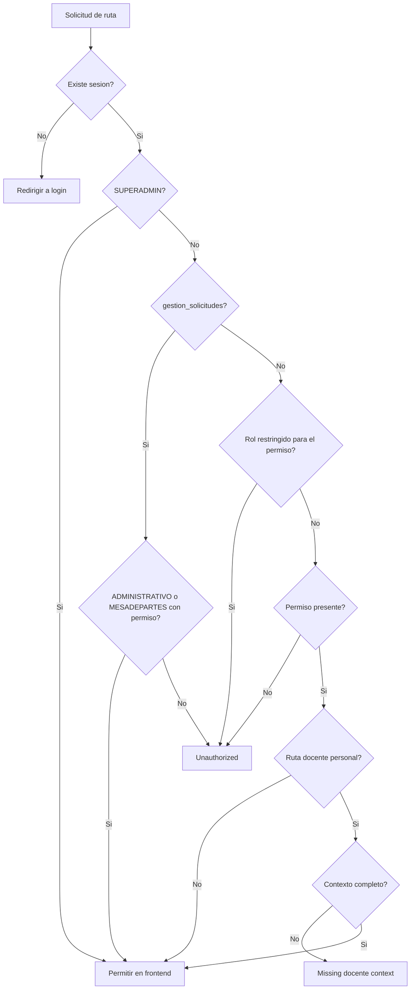

# 04 - User Roles And Permissions

## Fuentes de verdad `AS-IS`

- Roles: `lib/roles.ts`.
- Ruta a permiso: `lib/access-control.ts`.
- Evaluacion rol/permiso: `lib/permissions.ts`.
- Sidebar: `components/sidebar/app-sidebar.tsx`.
- Guard servidor: `lib/server-permissions.ts`.
- Guard cliente: `components/protected-route.tsx`.
- Permisos backend: `GET /rol-permisos/rol/:rol`.

## Roles

| Rol | Comportamiento actual |
| --- | --- |
| `SUPERADMIN` | Bypass de permisos en frontend; entra a todas las rutas protegidas |
| `ADMINISTRATIVO` | Necesita permiso; puede usar `gestion_solicitudes` e `importar_pagos`, pero permanece bloqueado para otros tres permisos sensibles |
| `MESADEPARTES` | Puede usar las rutas de `gestion_solicitudes` solo cuando el permiso viene en su sesion |
| `DOCENTE` | Necesita permiso y, en rutas personales, `docenteId` y `perfilId` |

## Permisos sensibles restringidos por rol

`lib/permissions.ts` bloquea tanto a `ADMINISTRATIVO` como a `DOCENTE`, aunque el backend entregue estos permisos:

- `gestion_constancias`
- `gestion_certificados`
- `examenes_ubicacion`

`gestion_solicitudes` tiene una politica explicita: `SUPERADMIN` usa bypass; `ADMINISTRATIVO` y `MESADEPARTES` requieren el permiso; `DOCENTE` y roles desconocidos se bloquean. `importar_pagos` depende del permiso cargado desde la base de datos. La decision sobre los otros tres permisos sensibles permanece abierta en `DECISION-001`.

## Matriz de rutas

| Familia de rutas | Permiso frontend | Superadmin | Administrativo `AS-IS` | Mesa de partes `AS-IS` | Docente `AS-IS` |
| --- | --- | --- | --- | --- | --- |
| `/dashboard` | Solo sesion | Si | Si | Si | Si, aunque su destino principal es experiencia docente |
| `/usuarios` | `gestionar_usuarios` | Si | Si, con permiso | Si, con permiso | Si, con permiso; requiere decision de producto |
| `/estructura` | `gestionar_estructura` | Si | Si, con permiso | Si, con permiso | Si, con permiso; requiere decision de producto |
| `/grupos/*` | `gestionar_estructura` | Si | Si, con permiso | Si, con permiso | Si, con permiso; requiere decision de producto |
| `/solicitudes/nueva`, `/solicitudes/constancias/*`, `/solicitudes/certificados/*`, `/solicitudes/ubicacion/*` | `gestion_solicitudes` | Si | Si, con permiso | Si, con permiso | Bloqueado |
| `/solicitudes/becas/*` | `gestion_becas` | Si | Si, con permiso | Si, con permiso | Si, con permiso; requiere decision de producto |
| `/solicitudes/importar-pagos` | `importar_pagos` | Si | Si, con permiso | Si, con permiso | Si, con permiso; no asignado `AS-IS` |
| `/certificados/*` | `gestion_certificados` | Si | Bloqueado | Si, con permiso | Bloqueado |
| `/constancias/*` | `gestion_constancias` | Si | Bloqueado | Si, con permiso | Bloqueado |
| `/examen-ubicacion/*` | `examenes_ubicacion` | Si | Bloqueado | Si, con permiso | Bloqueado |
| `/perfil-docente/docentes/*` | `gestion_docentes` | Si | Si, con permiso | Si, con permiso | Si, con permiso; no recomendado para experiencia personal |
| `/perfil-docente/ranking-docentes/*` | `perfil_docente_resultados` | Si | Si, con permiso | Si, con permiso | Si, con permiso |
| `/perfil-docente/mi-perfil` | `mi_perfil_docente` | Si | Si, con permiso | Si, con permiso | Si, con permiso y contexto |
| `/perfil-docente/mis-resultados` | `mi_perfil_docente_resultados` | Si | Si, con permiso | Si, con permiso | Si, con permiso y contexto |
| `/perfil-docente/encuestas/mi-encuesta` | `mi_encuesta_respuestas` | Si | Si, con permiso | Si, con permiso | Si, con permiso y contexto |

## Acciones visibles

- El sidebar elimina items cuyo permiso falla en `canAccessRoute`.
- Los botones dentro de una pagina no tienen una politica transversal por accion; normalmente heredan el permiso del modulo.
- `GAP-PERM-002`: lectura, creacion, edicion, eliminacion, firma y publicacion no tienen permisos separados.
- `GAP-PERM-003`: ocultar rutas en UI no demuestra que el controlador backend aplique el mismo rol o permiso.

## Flujo de autorizacion

## Reglas `TO-BE`

- El backend debe validar identidad y autorizacion para cada accion sensible.
- Una matriz aprobada debe definir si `ADMINISTRATIVO` usa permisos o bloqueo por rol.
- Acciones destructivas o de publicacion deben poder tener permisos mas granulares.
- Cambios de permisos deben invalidar o refrescar la sesion.
