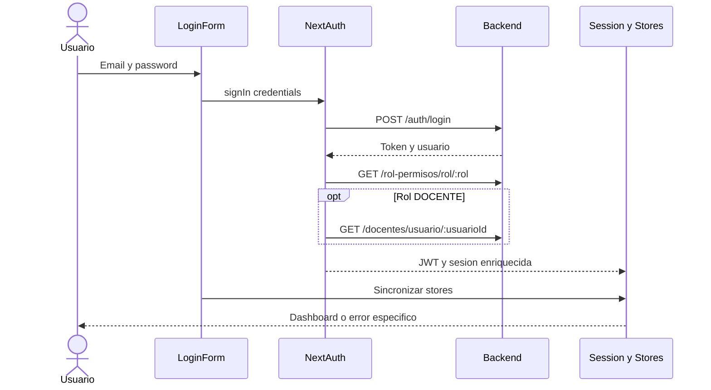
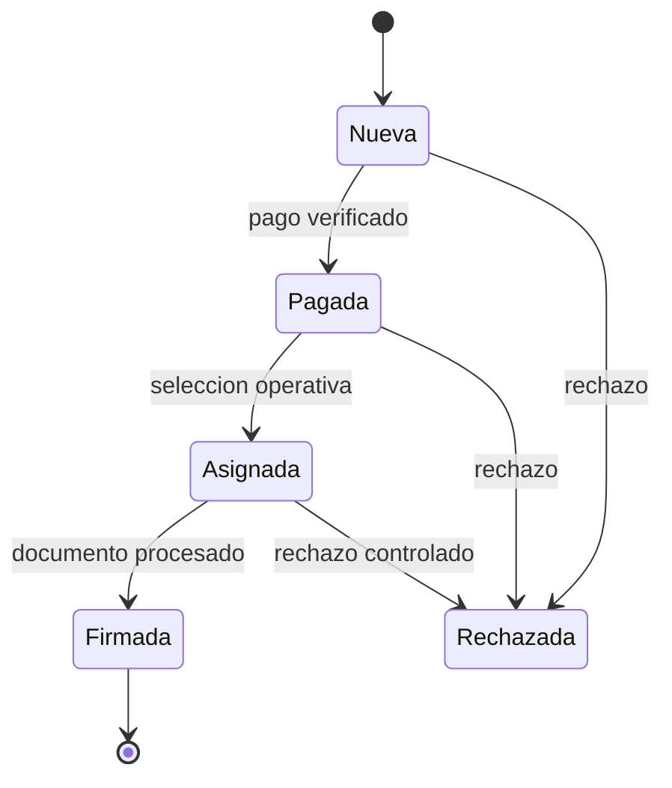

# 05 - User Stories And Flows

## Historias principales

| ID | Historia | Criterios principales |
| --- | --- | --- |
| `HU-AUTH-001` | Como usuario autorizado quiero iniciar sesion para acceder a mis funciones | `CA-AUTH-001..003` |
| `HU-DASH-001` | Como usuario quiero llegar a un dashboard coherente con mi rol | `CA-DASH-001` |
| `HU-USR-001` | Como superadministrador quiero gestionar usuarios y roles | `CA-USR-001` |
| `HU-ESTR-001` | Como responsable de plataforma quiero mantener catalogos academicos | `CA-ESTR-001` |
| `HU-GRP-001` | Como responsable academico quiero crear o importar grupos | `CA-GRP-001..002` |
| `HU-SOL-001` | Como operador quiero registrar y clasificar solicitudes | `CA-SOL-001..003` |
| `HU-CERT-001` | Como operador autorizado quiero emitir y procesar certificados | `CA-CERT-001..002` |
| `HU-CONS-001` | Como operador autorizado quiero emitir y entregar constancias | `CA-CONS-001..003` |
| `HU-EXU-001` | Como operador quiero administrar examenes y participantes | `CA-EXU-001..003` |
| `HU-EXU-002` | Como responsable quiero generar resultados por periodo e idioma | `CA-EXU-004` |
| `HU-SDOC-001` | Como administrativo quiero gestionar perfiles y seguimiento docente | `CA-SDOC-001..003` |
| `HU-SDOC-002` | Como docente quiero consultar solo mi informacion | `CA-SDOC-004..006` |

## Criterios globales

- `CA-AUTH-001`: credenciales validas crean sesion con token y rol.
- `CA-AUTH-002`: permisos fallidos no se presentan como credenciales invalidas.
- `CA-AUTH-003`: `DOCENTE` sin contexto recibe error especifico y no entra a rutas personales.
- `CA-DASH-001`: usuario autenticado llega a una ruta permitida y ve navegacion filtrada.
- `CA-USR-001`: alta, edicion, filtro y baja respetan permiso y validaciones.
- `CA-ESTR-001`: cambios de catalogo se reflejan sin mantener cache obsoleta.
- `CA-GRP-001`: grupo valido se crea con referencias existentes.
- `CA-GRP-002`: importacion informa filas aceptadas y rechazadas.
- `CA-SOL-001`: solicitud valida queda asociada a estudiante y estado inicial.
- `CA-SOL-002`: listas por tipo muestran solo estados solicitados.
- `CA-SOL-003`: rechazo u observacion conserva motivo y no elimina trazabilidad.
- `CA-CERT-001`: certificado queda asociado a solicitud y PDF.
- `CA-CERT-002`: firma actualiza documento y solicitud de forma consistente.
- `CA-CONS-001`: constancia valida queda asociada a solicitud.
- `CA-CONS-002`: matricula exige modalidad y horario; notas exige detalle valido.
- `CA-CONS-003`: firma, impresion y entrega siguen transiciones permitidas.
- `CA-EXU-001`: examen valido se crea con catalogos existentes.
- `CA-EXU-002`: solo solicitudes compatibles pueden asignarse como participantes.
- `CA-EXU-003`: calificacion finaliza participante y mantiene nivel resultante.
- `CA-EXU-004`: resultados incluyen solo periodo, idioma y participantes validos.
- `CA-SDOC-001`: perfiles y documentos mantienen relacion con docente.
- `CA-SDOC-002`: encuestas importadas se consultan por modulo y docente.
- `CA-SDOC-003`: ranking y cumplimiento usan el mismo periodo/modulo seleccionado.
- `CA-SDOC-004`: docente autenticado solo consulta su contexto.
- `CA-SDOC-005`: falta de `docenteId` o `perfilId` bloquea vistas personales.
- `CA-SDOC-006`: un docente no obtiene capacidades administrativas solo por manipular el store.

## Flujo de login

## Flujo solicitud a documento

`GAP-SOL-001`: los IDs y nombres de estado tienen aliases y usos distintos por modulo. La maquina anterior expresa el flujo documental esperado; cada spec identifica el comportamiento comprobado.

## Alternativas y errores

- Credenciales invalidas: permanecer en login y no crear estado local.
- Permisos no disponibles: cancelar login o mostrar error de autorizacion, no “credenciales invalidas”.
- Contexto docente ausente: no abrir rutas personales.
- API o upload fallido: conservar formulario y distinguir persistencia parcial.
- Catalogo faltante: bloquear submit y explicar dependencia.
- Ruta sin permiso: redirigir a dashboard con motivo.

