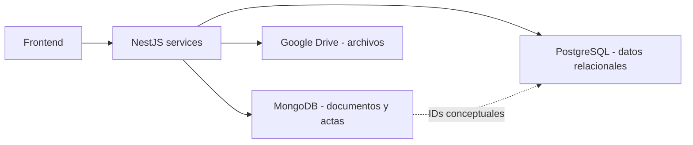
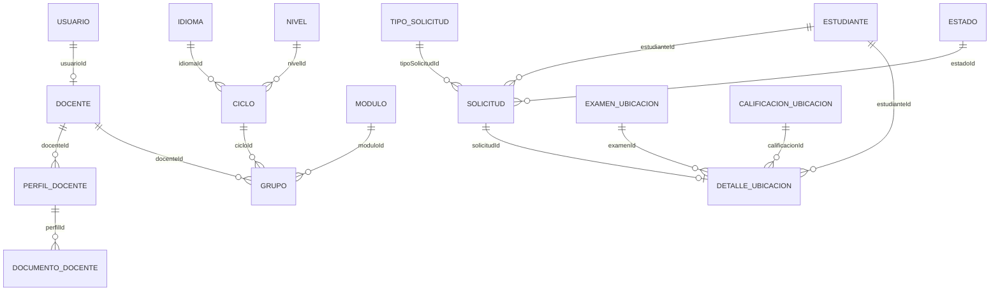
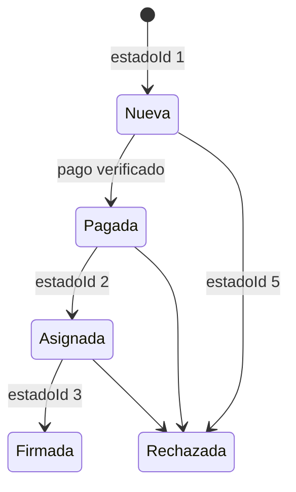
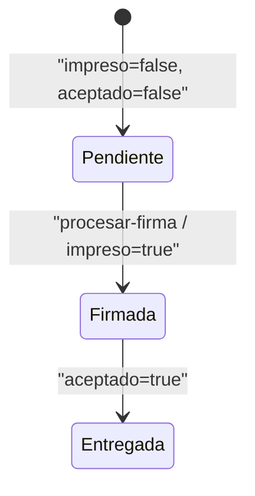

# 07 - Data Model

## Persistencia hibrida

El backend combina PostgreSQL mediante TypeORM y MongoDB mediante Mongoose. Las relaciones entre ambos motores se representan con IDs numericos o strings, pero no tienen integridad referencial automatica entre bases.

## Modelo relacional principal

## Entidades PostgreSQL

| Dominio | Entidades relevantes |
| --- | --- |
| Auth | `usuarios`, `permisos`, `rol_permisos` |
| Personas | `estudiantes`, `docentes` |
| Estructura | `aulas`, `ciclos`, `grupos`, `idiomas`, `niveles`, `modulos` |
| Auxiliares | `estados`, `facultades`, `escuelas` |
| Solicitudes | `solicitudes`, `tipos_solicitud`, `pagos_banco` |
| Calificaciones | `evaluaciones`, `notas`, `notas_final` |
| Examen ubicacion | `examenes_ubicacion`, `detallesubicacion`, `calificaciones_ubicacion`, `cronogramaubicacion` |
| Seguimiento | `perfil_docente`, `documentos_docente`, `academico_administrativo`, `cumplimiento_docente`, `puntaje_academico_administrativo`, `encuesta_*`, `perfil_docente_resultados`, `tipos_documento_perfil` |

## Documentos MongoDB

| Documento | Vinculo relacional | Proposito |
| --- | --- | --- |
| `Constancia` | `id_solicitud` | Datos emitidos, detalle de notas, URL y Drive IDs |
| `Certificado` | `solicitudId` | Certificado, notas, registro, URL y Drive IDs |
| `SolicitudBeca` | DNI/identificadores funcionales | Expediente de beca y archivos |
| `ActaExamenUbicacion` | `examenId` y datos embebidos | Snapshot documentario del examen |
| `ActaNota` | referencias academicas | Documento de notas |
| `Texto` | identificador propio | Textos configurables |

## Agregados de negocio

### Solicitud documental

La solicitud PostgreSQL es origen transaccional. Certificado y constancia viven en MongoDB y conservan su ID de solicitud. La API debe validar que el ID exista y que no se asocie de forma incompatible.

### Examen de ubicacion

El examen, participantes y calificaciones son relacionales. El acta MongoDB es una representacion documentaria derivada y debe conservar el examen origen.

### Seguimiento docente

Docente, perfil, documentos, encuestas, cumplimiento y resultados forman un agregado distribuido por `docenteId`, `perfilId` y `moduloId`.

## Estados

### Solicitud documental

- `AS-IS`: frontend define para documentos `nueva=1`, `asignada=2`, `finalizada=3`, `pagada=4`, `rechazada=5`, `observada=12`.
- `GAP-DATA-001`: backend solo centraliza constantes `FIRMADA=3` y `RECHAZADO=5`; otros IDs aparecen dispersos.
- `GAP-DATA-002`: aliases como finalizada, firmada, terminada y procesada pueden resolver estados distintos por texto.

### Constancia

### Certificado

El flujo usa colecciones pendientes, firmados e impresos, junto con archivo y procesamiento de firma. `GAP-DATA-003`: nombres de endpoint y booleanos no expresan una maquina de estados canonica.

## Integridad `TO-BE`

- Transiciones de solicitud y creacion de documento deben ejecutarse en backend.
- Relaciones MongoDB-PostgreSQL deben validarse antes de guardar.
- Cada estado debe tener constante canonica y transiciones permitidas.
- Eliminaciones deben definir efecto sobre archivos y entidad relacionada.
- Migraciones TypeORM deben ser explicitas; `synchronize` permanece desactivado.

