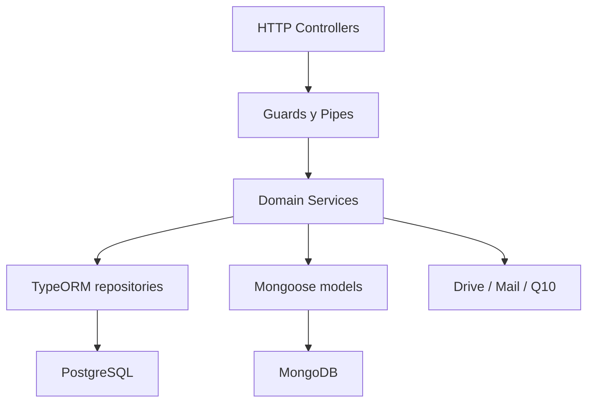
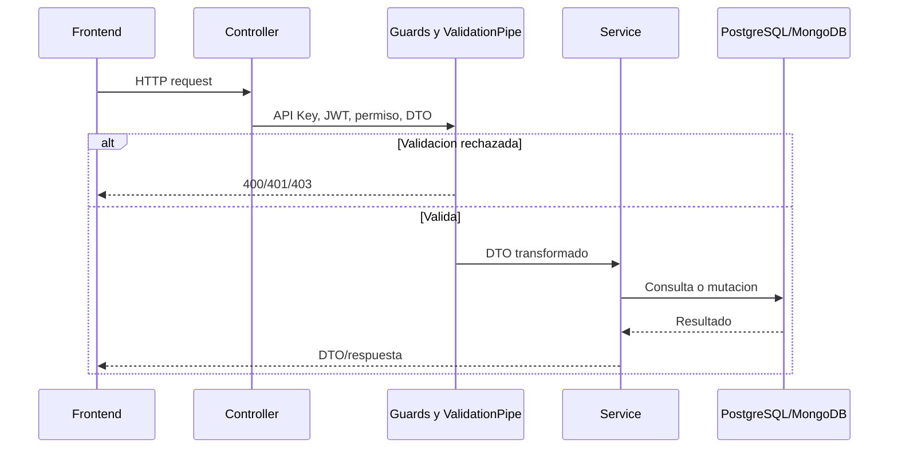

# 09 - Backend Architecture

## Stack

- NestJS 11 y TypeScript.
- PostgreSQL con TypeORM; `synchronize: false`.
- MongoDB con Mongoose.
- Passport/JWT y guards propios de API Key y permisos.
- `class-validator` y `ValidationPipe` global con whitelist.
- Swagger condicionado por ambiente.
- Google Drive, correo y Q10 como integraciones.

## Topologia

## Modulos

| Area | Modulos backend |
| --- | --- |
| Authentication | auth, usuarios, rol_permisos |
| Administrativas | solicitudes, solicitudbecas, tipossolicitud, pagos-banco, certificados, constancias |
| Estructura | aulas, ciclos, grupos, idiomas, niveles, modulos |
| Principales | estudiantes, docentes |
| Examen ubicacion | examenes, detalles, calificaciones, cronograma, actas |
| Seguimiento docente | perfiles, documentos, encuestas, cumplimiento, resultados, dashboard y catalogos |
| Calificaciones | evaluaciones, notas, notas finales, actas de notas |
| Shared | upload, mailer, reportes, Q10 |

## Flujo de request

## Persistencia

- TypeORM maneja entidades transaccionales y relaciones academicas.
- Mongoose maneja documentos de certificados, constancias, becas y actas.
- Servicios que cruzan motores deben validar relaciones manualmente.
- `GAP-BE-001`: no existe transaccion distribuida; firma implementa compensacion en algunos flujos, creacion documental no siempre.

## Seguridad `AS-IS`

- Usuarios y rol-permisos aplican API Key, JWT y `PermissionsGuard` a nivel controlador.
- Muchos CRUD academicos y administrativos solo aplican `ApiKeyGuard`.
- Algunos controladores de seguimiento no muestran guard de clase.
- Algunos metodos agregan JWT de forma aislada, por ejemplo actas y eliminacion de constancias.
- `GAP-BE-002`: la proteccion no es uniforme ni equivalente a los permisos visibles del frontend.

## Validacion y errores

- `ValidationPipe` global elimina propiedades no declaradas y rechaza extras.
- DTO usan `class-validator`/`class-transformer` con cobertura desigual.
- Excepciones Nest producen respuestas HTTP, pero no hay codigo de dominio uniforme.
- Integraciones externas requieren traduccion de errores y compensacion.

## Integraciones

| Integracion | Responsabilidad | Riesgo |
| --- | --- | --- |
| Google Drive | uploads, versiones firmadas y repositorios | consistencia entre DB y archivo |
| Q10 | horarios/cursos e importacion de grupos | disponibilidad y formato externo |
| Correo | envios por tipo de cuenta | secretos y entregabilidad |
| PostgreSQL | datos relacionales | migraciones y conexiones |
| MongoDB | documentos | integridad con IDs relacionales |

## Brechas estructurales

- `GAP-BE-003`: `AppModule` importa `EscuelasModule` y `CumplimientoDocenteModule` dos veces.
- `GAP-BE-004`: CORS contiene dominios codificados en `main.ts`; debe parametrizarse por ambiente.
- `GAP-BE-005`: no se observa una politica global de permisos por metadata para todos los controladores.
- `GAP-BE-006`: constantes de estados de solicitud estan incompletas.

## Arquitectura `TO-BE`

- Guard compuesto global para endpoints privados, con decoradores para excepciones publicas y permisos.
- Servicios de aplicacion para operaciones que cruzan solicitud, documento y storage.
- DTO de respuesta y error consistentes.
- CORS, Swagger e integraciones configurados por ambiente.
- Migraciones versionadas y rollback probado.
- Pruebas de contrato y autorizacion por controlador.

