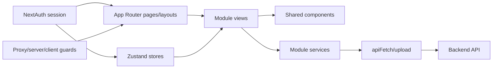

# 10 - Frontend Architecture

## Stack

- Next.js 16 App Router, React 19 y TypeScript.
- NextAuth v5 beta con proveedor credentials.
- Zustand 5 para sesion replicada, contexto docente y caches.
- React Hook Form y Zod.
- TanStack Table, Tailwind CSS, componentes UI y Sonner.
- React PDF para documentos generados en cliente.

## Capas



## Estructura

```text
app/                 rutas, layouts y composicion server/client
components/          UI, formularios, tablas, sidebar y guards compartidos
lib/                 permisos, roles, contexto y utilidades
modules/             dominios funcionales y sus servicios/componentes
services/            cliente HTTP, CRUD base y uploads
specs/modules/       contrato SDD por dominio
docs/                contrato transversal
```

## Inventario por patron

- 52 paginas: 2 publicas y 50 bajo el area principal.
- 18 formularios/schemas.
- 22 tablas/datatable.
- 26 servicios frontend.
- 4 stores: `auth`, `docente`, `opciones` y `perfil-opciones`.

## Renderizado y datos

- Paginas server obtienen datos antes de renderizar y pueden redirigir.
- Componentes client gestionan formularios, tablas, dialogs, PDFs y mutaciones.
- `BaseService` abstrae CRUD simple; servicios especializados agregan query, upload o acciones.
- `apiFetch` recupera sesion en cliente o servidor y agrega headers.
- `GAP-FE-001`: `apiFetch` usa `require('@/auth')` dinamico en servidor y `any` para access token; necesita contrato tipado y separacion server/client.

## Estado global

| Store | Storage | Contenido | Riesgo |
| --- | --- | --- | --- |
| `useAuthStore` | localStorage | usuario y permisos | duplica NextAuth |
| `useDocenteStore` | localStorage | docenteId y perfilId | puede quedar obsoleto |
| `useOpcionesStore` | sessionStorage | catalogos generales | invalidacion manual |
| `usePerfilOpcionesStore` | sessionStorage | catalogos docentes | invalidacion manual |

NextAuth debe ser autoridad de identidad; los stores son proyecciones de UI y no autorizan backend.

## Inventario de servicios

Los 26 servicios se distribuyen asi:

- Core: `api.service.ts`, `base.service.ts`, `upload.service.ts`.
- Usuarios: `usuarios.service.ts`, `rol-permiso.service.ts`.
- Estructura: `opciones.service.ts`, `textos.service.ts`.
- Grupos: `grupo.service.ts`.
- Solicitudes: `solicitudes.service.ts`, `solicitud-estudiantes.service.ts`, `solicitud-becas.service.ts`.
- Certificados: `certificados.service.ts`, `certificado-reporte.service.ts`.
- Constancias: `constancias.service.ts`.
- Examen: `examenes-ubicacion.service.ts`, `actas-examen-ubicacion.service.ts`, `calificaciones.service.ts`, `cronograma-ubicacion.service.ts`.
- Seguimiento: `docente.service.ts`, `perfil-docente.service.ts`, `documentos-docente.service.ts`, `perfil-opciones.service.ts`, `encuesta.service.ts`, `preguntas.service.ts`, `cumplimiento.service.ts`, `prefil-resultado.service.ts`.

## Componentes compartidos

- Campos RHF en `components/forms`.
- Tablas genericas en `components/datatable`.
- Sidebar filtrado por permisos.
- Dialogs de confirmacion, preview PDF, breadcrumbs y estados vacios.
- Los componentes de dominio permanecen bajo `modules/<dominio>`.

## Rutas y proteccion

- `proxy.ts`: primer filtro de sesion/ruta.
- `ensureServerPermission`: proteccion de pagina server.
- `ProtectedRoute`: proteccion cliente y contexto docente.
- Sidebar: visibilidad, no seguridad.
- `GAP-FE-002`: las reglas se repiten en varias capas y pueden desalinearse.
- `GAP-FE-003`: rutas dinamicas se cubren normalmente por prefijos generales; reglas con `[id]` no representan el pathname real por si solas.

## Formularios y tablas

- Formularios criticos deben usar schema, valores iniciales, estado submitting y mensajes inline.
- Tablas deben declarar columnas, filtro, paginacion, acciones, permiso y estados loading/empty/error.
- Edicion inline requiere validacion equivalente a formularios.

## PDFs y uploads

- Certificados, constancias y examen generan previews o blobs con React PDF.
- Upload usa servicio separado y puede ocurrir despues de persistir datos.
- Flujos deben informar exito parcial y permitir reintento idempotente.

## Arquitectura `TO-BE`

- Sesion como fuente canonica y stores derivados recuperables.
- Cliente HTTP tipado con error de dominio uniforme.
- Matriz de rutas generada desde una unica configuracion consumida por sidebar y guards.
- Schemas compartidos por dominio donde frontend y backend puedan contrastarse.
- Pruebas de componentes, servicios y rutas protegidas antes de refactors.
