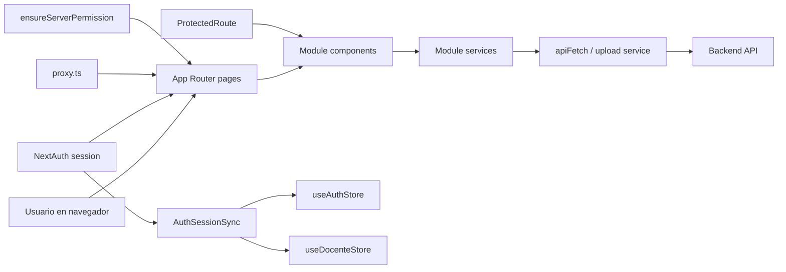

# 10 - Frontend Architecture

## Objetivo

Documentar la arquitectura actual del frontend de `ciunac-admin-2` para que las decisiones de producto, seguridad, validacion y pruebas se escriban primero como especificacion antes de tocar codigo.

## Stack base

- `Next.js 16` con `App Router`
- `React 19`
- `TypeScript`
- `NextAuth v5 beta` para autenticacion
- `Zustand` para estado persistido en cliente
- `react-hook-form` + `zod` para formularios y validacion
- `Tailwind CSS` + componentes UI compartidos
- `Sonner` para notificaciones

## Estructura principal del proyecto

```text
app/
  (login)/                 Paginas publicas de acceso y registro
  (main)/                  Paginas autenticadas y modulos de negocio
components/
  forms/                   Campos reutilizables sobre react-hook-form
  sidebar/                 Navegacion principal basada en permisos
  ui/                      Biblioteca UI compartida
lib/
  access-control.ts        Mapa ruta -> permiso
  permissions.ts           Reglas de autorizacion por rol y permiso
  role-context.ts          Reglas para contexto DOCENTE
modules/
  usuarios/
  estructura/
  grupos/
  seguimiento-docente/
  solicitudes/
  constancias/
  examen-ubicacion/
services/
  api.service.ts           Cliente HTTP base
  base.service.ts          CRUD generico para colecciones
types/
  next-auth.d.ts           Tipado de session y JWT
```

## Capas y flujo de datos



## Route groups y layouts

| Capa | Ruta / archivo | Responsabilidad |
| --- | --- | --- |
| Root layout | `app/layout.tsx` | Fuentes, `Providers`, `Toaster`, metadata global |
| Publico | `app/(login)` | Login y registro |
| Privado | `app/(main)` | Shell autenticado con sidebar y contenido principal |
| Proxy | `proxy.ts` | Primer filtro de acceso por sesion |
| Server guard | `lib/server-permissions.ts` | Bloqueo por permiso en paginas server |
| Client guard | `components/protected-route.tsx` | Bloqueo por permiso/contexto en paginas client |

## Modulos funcionales

| Modulo | Ruta principal | Directorio | Servicios clave |
| --- | --- | --- | --- |
| Usuarios | `/usuarios` | `modules/usuarios` | `usuarios.service.ts`, `rol-permiso.service.ts` |
| Estructura | `/estructura` | `modules/estructura` | `opciones.service.ts`, `textos.service.ts` |
| Grupos | `/grupos` | `modules/grupos` | `grupo.service.ts` |
| Seguimiento docente | `/perfil-docente` | `modules/seguimiento-docente` | `docente.service.ts`, `perfil-docente.service.ts`, `encuesta.service.ts`, `cumplimiento.service.ts`, `prefil-resultado.service.ts` |
| Solicitudes | `/solicitudes/*` | `modules/solicitudes` | `solicitudes.service.ts`, `solicitud-becas.service.ts` |
| Constancias | `/constancias` | `modules/constancias` | `constancias.service.ts` |
| Examen de ubicacion | `/examen-ubicacion` | `modules/examen-ubicacion` | `examenes-ubicacion.service.ts`, `cronograma-ubicacion.service.ts`, `calificaciones.service.ts` |

## Patron de modulos

Cada modulo sigue, con variaciones, este patron:

- `components/`: tablas, formularios, dialogs y vistas
- `interfaces/`: contratos de datos del frontend
- `services/`: acceso HTTP a recursos del backend
- `forms/`: schemas y formularios cuando aplica
- `store/` o `hook/`: cache local o estado derivado cuando el flujo lo requiere

## Estado de aplicacion

### Estado de sesion

- `NextAuth` conserva `accessToken`, `rol`, `permisos`, `docenteId` y `perfilId` en JWT y `session.user`.
- `useAuthStore` replica usuario y permisos en `localStorage`.
- `useDocenteStore` replica `docenteId` y `perfilId` para experiencias del rol `DOCENTE`.

### Estado de catalogos

- `modules/estructura/hooks/use-opciones.ts` cachea catalogos maestros.
- `modules/seguimiento-docente/opciones/perfil-opciones.hook.ts` cachea catalogos del dominio docente.

## Navegacion y permisos

- La navegacion del sidebar se construye desde rutas concretas y `requiredPermission`.
- `lib/access-control.ts` es la fuente de verdad para el permiso requerido por ruta.
- `lib/permissions.ts` aplica reglas por rol, permisos y restricciones adicionales.
- `lib/role-context.ts` obliga contexto docente en rutas del dominio docente.

## Convenciones de acceso a datos

- `BaseService` cubre CRUD simple sobre una coleccion.
- Los servicios especializados agregan endpoints compuestos, filtros por query y uploads.
- `apiFetch` agrega `x-api-key` y, si hay sesion, `Authorization: Bearer <token>`.
- `upload.service.ts` centraliza uploads binarios y CSV.

## Convenciones de UX

- Formularios basados en `react-hook-form`.
- Validacion local con `zod` donde ya existe schema.
- Errores operativos expuestos con `toast`.
- Acciones de alto riesgo protegidas con disable/loading y, segun modulo, confirmacion.

## Acoplamientos actuales a tener presentes

- La app depende de un backend externo configurado por `NEXT_PUBLIC_API_URL`.
- El control de acceso esta duplicado en proxy, servidor y cliente.
- Existen modulos con buena cobertura de schemas (`constancias`, `grupos`, `perfil-docente`, `docentes`, `examen-ubicacion`) y otros que aun dependen de validaciones implicitas.
- La sesion vive tanto en `NextAuth` como en stores de cliente, por lo que toda decision de arquitectura futura debe evitar desincronizacion.

## Convencion para spec-driven development

- Primero se actualizan `docs/` y `specs/modules/*`.
- Luego se implementan contratos, rutas, validaciones y pruebas.
- Ningun modulo debe avanzar a implementacion sin:
  - objetivo claro
  - endpoints definidos
  - modelo de datos identificado
  - reglas de negocio y errores documentados
  - plan de pruebas acordado
