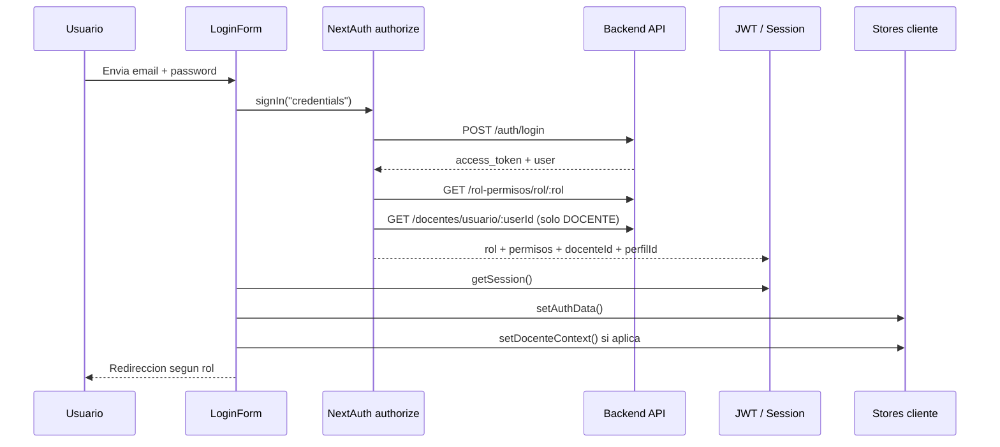

# 11 - Auth Security

## Objetivo

Definir el comportamiento esperado de autenticacion, autorizacion y controles de seguridad del frontend, tomando como fuente de verdad el estado actual del repositorio y dejando claras las reglas que deben mantenerse en cualquier cambio futuro.

## Componentes involucrados

- `auth.ts`
- `auth.config.ts`
- `proxy.ts`
- `components/providers.tsx`
- `components/login-form.tsx`
- `components/protected-route.tsx`
- `lib/access-control.ts`
- `lib/permissions.ts`
- `lib/role-context.ts`
- `lib/server-permissions.ts`
- `modules/usuarios/store/auth.store.ts`
- `modules/seguimiento-docente/docentes/docente.store.ts`

## Flujo de autenticacion

## Roles soportados

| Rol | Uso principal | Regla clave |
| --- | --- | --- |
| `SUPERADMIN` | Acceso total | Bypass de permisos por rol |
| `ADMINISTRATIVO` | Operacion administrativa | Requiere permisos explicitos |
| `DOCENTE` | Experiencia personal docente | Requiere permisos y contexto `docenteId` + `perfilId` |

## Modelo de sesion

La sesion enriquecida debe conservar como minimo:

- `user.id`
- `user.email`
- `user.name`
- `user.rol`
- `user.permisos[]`
- `user.docenteId` cuando aplica
- `user.perfilId` cuando aplica
- `accessToken`

## Reglas de autorizacion

### 1. Proteccion por ruta

- `lib/access-control.ts` define el permiso requerido por ruta.
- Si una ruta protegida no tiene sesion, se devuelve al login.
- Si la ruta requiere permiso y el usuario no lo tiene, debe ir a `/dashboard?error=unauthorized`.

### 2. Rol `SUPERADMIN`

- `isSuperAdminRole()` concede acceso a cualquier ruta protegida.
- El bypass solo debe usarse para autorizacion, no para saltarse trazabilidad o validaciones de negocio.

### 3. Rol `DOCENTE`

- Para rutas del dominio docente se exige contexto completo.
- Si falta `docenteId` o `perfilId`, el flujo debe enviar a `/dashboard?error=missing-docente-context` o mostrar mensaje equivalente.
- El contexto debe poder recuperarse desde backend al iniciar sesion.

### 4. Restricciones adicionales por rol

El frontend ya bloquea a `DOCENTE` y `ADMINISTRATIVO` en permisos sensibles:

- `gestion_constancias`
- `gestion_solicitudes`
- `examenes_ubicacion`
- `importar_pagos`

Estas restricciones deben seguir existiendo tambien en backend.

## Capas de control actuales

| Capa | Archivo | Funcion |
| --- | --- | --- |
| Edge/proxy | `proxy.ts` | Primer filtro de acceso |
| Session callback | `auth.config.ts` | Enriquecimiento de JWT y session |
| Server guard | `lib/server-permissions.ts` | Proteccion de paginas server |
| Client guard | `components/protected-route.tsx` | Proteccion de vistas client |
| Sidebar | `components/sidebar/app-sidebar.tsx` | Oculta rutas no permitidas |

## Reglas de redireccion

- Usuario sin sesion:
  - intento a ruta protegida -> login `/`
- Usuario autenticado que entra a `/`:
  - `DOCENTE` -> `/perfil-docente/mis-resultados`
  - otros roles -> `/dashboard`
- Usuario sin permiso:
  - `/dashboard?error=unauthorized`
- Usuario docente sin contexto:
  - `/dashboard?error=missing-docente-context`

## Variables de entorno esperadas

| Variable | Uso | Tipo |
| --- | --- | --- |
| `NEXT_PUBLIC_API_URL` | URL base del backend | Publica |
| `NEXT_PUBLIC_API_KEY` | Header `x-api-key` para requests | Publica |
| `AUTH_SECRET` | Firma de NextAuth | Secreta |

## Politicas de seguridad recomendadas

- El backend debe seguir siendo la autoridad final de permisos.
- El frontend no debe depender solo de ocultar botones o links.
- Cualquier logging de payloads de login debe estar deshabilitado en produccion.
- Los stores locales nunca deben almacenar secretos adicionales fuera de la sesion minima requerida.
- Los cambios de permiso por rol deben invalidar o refrescar sesion antes de dar por vigente la nueva autorizacion.

## Riesgos actuales a vigilar

- `NEXT_PUBLIC_API_KEY` es visible por definicion; no debe tratarse como control suficiente por si sola.
- Hay varias capas de autorizacion; cualquier cambio debe mantenerse consistente en las tres.
- Si un flujo client-only usa stores locales sin refrescar desde sesion, puede aparecer desincronizacion temporal.
- La recuperacion de contexto docente depende de que el backend devuelva `docente.id` y `perfil.id`.

## Checklist de aceptacion

- El login devuelve siempre rol y token validos o falla de forma explicita.
- Los permisos se cargan de forma consistente para roles no `SUPERADMIN`.
- Un `DOCENTE` puede entrar a sus rutas propias solo cuando existe contexto completo.
- Las rutas protegidas quedan cubiertas por permiso y redireccion de error.
- La navegacion del sidebar refleja exactamente lo que el usuario puede abrir.
