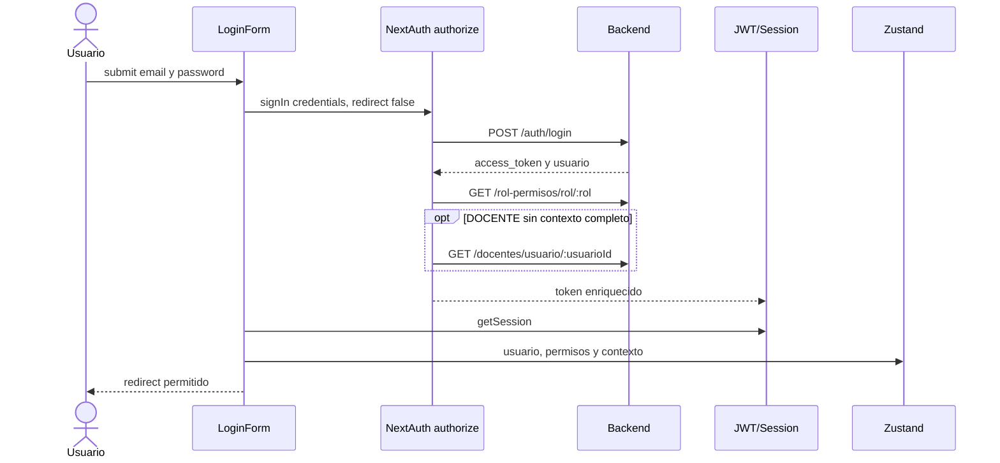

# 11 - Authentication And Security

## Flujo `AS-IS`

## Payload de sesion

- `accessToken`.
- `user.id`, `email`, `name` y `rol`.
- `user.permisos[]`.
- `user.docenteId` y `user.perfilId` cuando aplica.

## Comportamiento por rol

### SUPERADMIN

- Login puede continuar aun sin permisos explicitos porque frontend aplica bypass.
- Ve todas las opciones protegidas.
- El bypass frontend no obliga al backend a permitir la operacion; backend debe reconocer el rol o permiso.

### ADMINISTRATIVO

- Depende de carga de permisos.
- Puede usar `gestion_solicitudes` cuando el permiso esta presente en la sesion.
- Puede usar `importar_pagos` cuando el permiso esta presente en la sesion; la asignacion vigente figura como `permiso_id=33`.
- Permanece bloqueado para certificados, constancias y examenes aunque posea esos permisos; esta parte sigue pendiente en `DECISION-001`.

### MESADEPARTES

- El rol entregado por el backend se conserva en JWT, sesion y Zustand.
- Puede usar `gestion_solicitudes` solo si `GET /rol-permisos/rol/MESADEPARTES` devuelve el permiso.
- Sin el permiso, el sidebar oculta las opciones y las capas frontend bloquean el acceso directo.
- El login redirige a `/dashboard`, igual que para otros roles no docentes.
- `GAP-AUTH-002`: el enum backend reconoce este rol, pero `data.sql` no lo incluye y no debe usarse como esquema vigente sin corregirlo.

### DOCENTE

- Requiere permisos de experiencia personal.
- Requiere `docenteId` y `perfilId` para rutas personales.
- El lookup correcto del backend es `GET /docentes/usuario/:usuarioId`.
- Si falta contexto, el error debe ser especifico y no “login fallido”.

## Capas de control

| Capa | Responsabilidad | Autoridad de seguridad |
| --- | --- | --- |
| NextAuth | autenticar y construir sesion | Identidad frontend |
| Proxy | redireccion temprana | No sustituye backend |
| Server helper | permiso en paginas server | UX/SSR |
| ProtectedRoute | permiso y contexto client | UX |
| Sidebar | visibilidad | No |
| Backend guards | identidad y autorizacion | Si |

## Amenazas y controles

| Riesgo | Estado | Control requerido |
| --- | --- | --- |
| API Key expuesta | `NEXT_PUBLIC_API_KEY` es publica | No usarla como autenticacion de usuario |
| Store manipulado | Zustand vive en navegador | Backend valida JWT y permiso |
| Sesion/store desincronizados | Datos duplicados | Rehidratar stores desde sesion y limpiar al logout |
| Endpoint con solo API Key | Presente en muchos controladores | Agregar JWT y permiso por accion |
| Enumeracion de usuario/docente | Lookup por IDs | Verificar actor y alcance |
| Registro publico | `/registro` accesible | Decidir habilitacion por ambiente |
| Token en logs | Riesgo operacional | Sanitizar logs y errores |

## Seguridad `TO-BE`

- Endpoint privado = API Key de aplicacion + JWT valido + permiso/ownership.
- Endpoints publicos se marcan explicitamente.
- `DOCENTE` usa ownership backend, no solo IDs del cliente.
- Permisos de sesion tienen estrategia de refresco o expiracion.
- Acciones de firma, rechazo, eliminacion y publicacion generan auditoria.
- Rate limiting para login y uploads.

## Casos obligatorios

- Superadmin con y sin permisos cargados.
- Administrativo y mesa de partes con `gestion_solicitudes` presente y faltante.
- Administrativo con `importar_pagos` presente y faltante.
- Docente y rol desconocido con `gestion_solicitudes` asignado accidentalmente.
- Docente con contexto completo, parcial e inexistente.
- Token expirado, API Key invalida y permiso revocado.
- Manipulacion de localStorage sin token valido.
