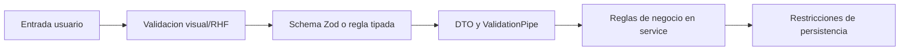

# 12 - Validation Rules

## Estrategia

Frontend mejora UX; backend es autoridad. Un dato valido por tipo puede seguir siendo invalido por negocio.

## Inventario de formularios y schemas

| Dominio | Archivos cubiertos | Reglas relevantes |
| --- | --- | --- |
| Auth | login y registro | email, password, rol |
| Grupos | grupo, schema e importacion | modulo, ciclo, docente, modalidad, periodo |
| Solicitudes | nueva solicitud y schema | estudiante, tipo, pago, catalogos |
| Certificados | formulario y schema | solicitud, registro, curso y notas |
| Constancias | formulario y schema | solicitud, tipo y regla matricula/notas |
| Examen ubicacion | formulario | fecha, estado, aula, docente, idioma y codigo |
| Docentes | formulario y schema | identidad, documento, genero y contacto |
| Perfil docente | perfil/documento y dos schemas | docente, idioma, experiencia, puntaje y documento |

## Reglas comunes

- Strings funcionales se recortan y no aceptan vacio.
- IDs se convierten y validan como numero/string segun contrato.
- Fechas se validan antes de serializar.
- Enums no aceptan valores fuera del catalogo.
- Booleanos tienen default explicito.
- Referencias deben existir y estar activas cuando el negocio lo exige.
- Parametros de ruta usan pipes o validacion equivalente.

## Reglas por dominio

- Auth: email valido; password minima; rol conocido.
- Grupos: modulo, ciclo y docente compatibles; importacion exige periodo.
- Solicitudes: estudiante valido, tipo y estado de referencia `SOLICITUD`, pago coherente.
- Certificados: solicitud compatible y notas sin duplicados funcionales.
- Constancias: `MATRICULA` exige modalidad y horario; `NOTAS` exige detalle coherente.
- Examen: solicitud pagada antes de asignar; nota/calificacion/nivel compatibles.
- Seguimiento: contexto docente completo en vistas personales; archivos y CSV con estructura esperada.

## Archivos

| Flujo | Validacion minima |
| --- | --- |
| DNI, voucher, beca, CV | archivo presente, tipo/tamano permitido y carpeta valida |
| Pagos CSV | extension, headers, filas y montos |
| Encuestas CSV | extension, preguntas/columnas y modulo |
| Certificado/constancia PDF | MIME PDF, documento asociado y estrategia de reemplazo |

`GAP-VAL-001`: frontend no aplica de forma uniforme tipo y tamaño antes de upload.

## Validacion visual

- Error junto al campo y `aria-describedby` cuando aplique.
- Primer campo invalido recibe foco.
- Submit muestra estado ocupado y evita doble envio.
- Errores de catalogo bloquean submit con explicacion.
- Error backend no borra valores.

## Brechas

- `GAP-VAL-002`: tablas editables carecen de schema uniforme.
- `GAP-VAL-003`: algunos servicios usan `any` y ocultan diferencias de DTO.
- `GAP-VAL-004`: estados se resuelven por ID o alias de texto sin contrato unico.
- `GAP-VAL-005`: validaciones Zod y DTO backend no tienen pruebas de contrato compartidas.
