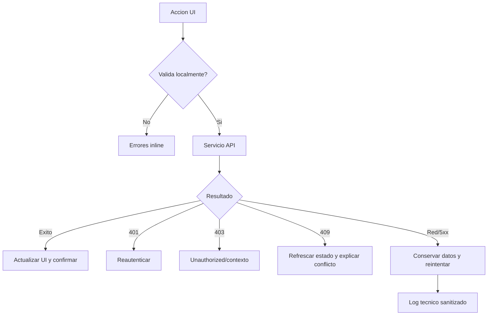

# 13 - Error Handling

## Taxonomia

| Tipo | HTTP esperado | UX |
| --- | --- | --- |
| Validacion | 400/422 | error inline y resumen |
| Credenciales | 401 | mensaje de login invalido |
| Autorizacion | 403 | redireccion/estado unauthorized |
| Contexto docente | 403/409 de dominio | mensaje missing context |
| No encontrado | 404 | estado no encontrado y retorno seguro |
| Conflicto/transicion | 409 | explicar estado actual y refrescar |
| Integracion | 502/503 | conservar datos y permitir reintento |
| Interno | 500 | mensaje generico y correlationId |

## Flujo



## Estado `AS-IS`

- `apiFetch` lanza `Error` con status y body como texto.
- Algunos servicios propagan error; otros devuelven `false` o `undefined`.
- Formularios y tablas usan toasts locales.
- Redirecciones usan query params `unauthorized` y `missing-docente-context`.
- `GAP-ERR-001`: no existe tipo de error comun ni codigo de dominio.
- `GAP-ERR-002`: algunos catch convierten problemas de permiso/contexto en error generico.

## Contrato `TO-BE`

```ts
type ApiError = {
  statusCode: number
  code: string
  message: string
  details?: Record<string, unknown>
  correlationId?: string
}
```

- Servicios retornan datos o lanzan un error tipado; no mezclan booleanos silenciosos.
- UI traduce `code` a mensaje de usuario.
- Backend registra causa e integracion sin exponer secretos.
- Operaciones parciales devuelven fases completadas y accion de recuperacion.

## Operaciones parciales criticas

- Crear documento y luego fallar PDF/upload.
- Asignar solicitud y luego cancelar creacion de constancia.
- Mover archivo firmado y luego fallar actualizacion de solicitud.
- Importar CSV con filas validas e invalidas.

Cada spec define compensacion, reintento e idempotencia.

## Estados visuales

- `loading`: skeleton/spinner sin accion duplicada.
- `empty`: mensaje y accion permitida.
- `error`: causa comprensible y reintento.
- `partial`: datos guardados, archivo/segunda fase pendiente.
- `unauthorized`: sin revelar datos protegidos.
