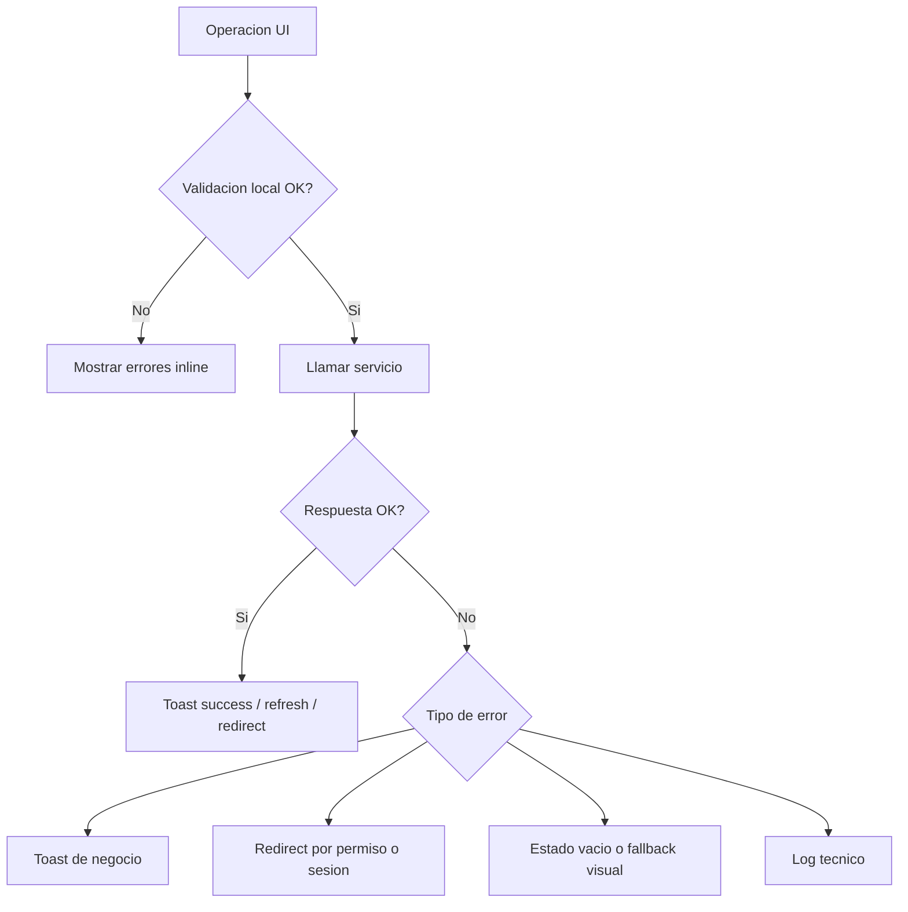

# 13 - Error Handling

## Objetivo

Definir una politica uniforme de manejo de errores para auth, formularios, servicios, uploads y vistas protegidas.

## Taxonomia de errores

| Categoria | Ejemplos | Respuesta esperada |
| --- | --- | --- |
| Validacion | Campo requerido, enum invalido, fecha invalida | Error inline por campo |
| Autenticacion | Credenciales invalidas, sesion expirada | Toast + retorno al login si corresponde |
| Autorizacion | Permiso faltante, rol restringido | Redireccion o estado `unauthorized` |
| Contexto docente | `docenteId` o `perfilId` faltante | Redireccion o banner explicativo |
| Red / backend | Timeout, 500, API caida | Toast operativo + opcion de reintento |
| Upload | Archivo no valido, rechazo de storage | Toast especifico + conservar formulario |
| Datos vacios | Lista sin resultados, detalle inexistente | Estado vacio, no toast salvo que sea inesperado |

## Patrones actuales del proyecto

- `apiFetch` lanza `Error` en fallos de red o HTTP no OK.
- Algunos servicios encapsulan el error y retornan `false` o `undefined`.
- Las vistas client suelen mostrar `toast.error(...)`.
- Las vistas server y guards usan `redirect(...)`.
- `ProtectedRoute` y `auth.config.ts` usan query params de error para denegaciones.

## Politica estandar recomendada

### Formularios

- Mostrar error inline para campos.
- Mostrar `toast.error` solo para fallos de submit o backend.
- Mantener el formulario montado y conservar valores cuando falle el submit.

### Servicios

- Preferir una sola estrategia por servicio:
  - o lanzar `Error`
  - o devolver resultado tipado `ok/error`
- Evitar mezclar `throw`, `false` y `undefined` para la misma clase de fallo.

### Guards y paginas protegidas

- Sin sesion -> login
- Sin permiso -> `/dashboard?error=unauthorized`
- Sin contexto docente -> `/dashboard?error=missing-docente-context`

### Uploads

- Preservar el archivo seleccionado mientras sea posible.
- Traducir errores HTTP a mensajes orientados al usuario.
- Registrar detalle tecnico solo en consola o herramienta de observabilidad.

## Flujo recomendado

## Reglas de logging

- No loggear payloads sensibles de login en produccion.
- Log tecnico con contexto minimo:
  - recurso
  - operacion
  - status
  - id relevante si existe
- No exponer stack traces al usuario final.

## Contrato minimo para mensajes de UI

- Mensaje corto:
  - `No se pudo guardar el examen`
- Descripcion opcional:
  - `Verifica los campos obligatorios o intenta nuevamente`
- Accion opcional:
  - reintentar
  - volver a cargar
  - contactar al administrador

## Estados visuales obligatorios

- `loading`
- `error`
- `empty`
- `success`
- `unauthorized`

## Riesgos actuales

- Existen servicios con contratos de error heterogeneos.
- Algunos `catch` esconden el motivo real del fallo.
- La capa de auth tiene varios puntos de decision y debe mantener mensajes coherentes.
- Los uploads dependen de un backend externo y necesitan mensajes mas uniformes.

## Checklist de aceptacion

- Cada modulo documenta que errores puede emitir.
- El usuario siempre sabe si el problema es validacion, permisos o backend.
- Los errores de permisos no se silencian como si fueran fallos genericos.
- Los servicios nuevos no mezclan `throw` y retorno booleano sin documentarlo.
