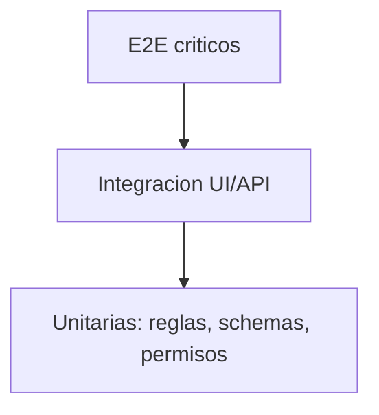

# 14 - Testing Plan

## Estado actual

- Frontend: lint configurado; no existe suite automatizada versionada.
- Backend: Jest, ts-jest, Supertest y comandos unit/e2e/cobertura.

## Stack objetivo

| Capa | Herramienta |
| --- | --- |
| Frontend unit/component | Vitest + Testing Library |
| Mock HTTP | MSW |
| Frontend E2E | Playwright |
| Backend unit/integration | Jest + Nest Testing |
| Backend E2E | Jest + Supertest |
| Contrato | Swagger/OpenAPI y fixtures compartidos |

## Piramide

## Cobertura prioritaria

1. Auth, permisos y contexto docente.
2. Transiciones de solicitudes y documentos.
3. Upload, firma y consistencia entre persistencias.
4. Formularios con reglas condicionales.
5. Importaciones CSV.
6. Rutas y acciones visibles por rol.
7. Ordenamiento, filtros, visibilidad y paginacion de tablas no editables.

## Matriz por cambio

| Cambio | Unit | Integration | E2E | Security |
| --- | --- | --- | --- | --- |
| Auth/permiso | Si | Si | Si por rol | Si |
| Schema/form | Si | Si | flujo critico | validacion input |
| Endpoint | servicio | contrato | consumidor | guard |
| Estado | maquina | persistencia | flujo | transicion invalida |
| Upload | helper | storage mock | smoke | tipo/tamano/ownership |
| Tabla no editable | texto `es-PE`, numeros, fechas y columnas | ordenar + filtrar + paginar | ascendente/descendente | acciones no ordenables |

## Fixtures

- Superadmin.
- Administrativo con permiso, sin permiso y permiso restringido.
- Docente con contexto completo, parcial y ausente.
- Catalogos activos/inactivos.
- Solicitudes en cada estado.
- Certificados y constancias con/sin archivo.
- Examen con participantes completos e incompletos.
- CSV valido, invalido y parcialmente valido.

## Pipeline objetivo

1. Markdown/links/Mermaid documental.
2. ESLint y typecheck.
3. Frontend unit/component.
4. Backend unit/integration.
5. Contract tests.
6. Playwright smoke por rol.
7. Build de ambos repos.

## Criterios de salida

- Cada `CA-*` tiene al menos un `TEST-*`.
- Cada endpoint sensible tiene prueba 401, 403 y caso permitido.
- Cada transicion tiene prueba valida e invalida.
- Bugs corregidos agregan prueba de regresion.
- Tests no dependen de datos productivos ni Drive real salvo smoke controlado.
