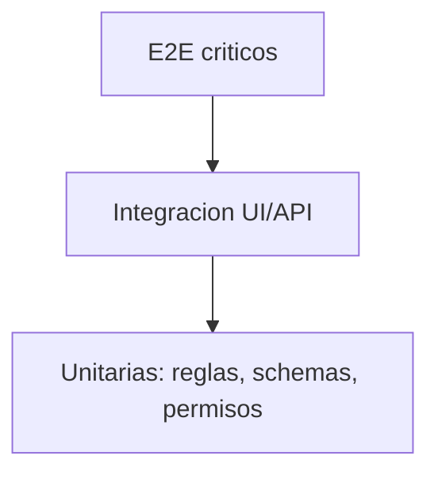

# 14 - Testing Plan

## Estado actual

- Frontend: lint configurado y regresion Node focalizada para integridad de glifos en certificados; la suite general de componentes continua pendiente.
- Backend: Jest, ts-jest, Supertest y comandos unit/e2e/cobertura.

## Stack objetivo

| Capa | Herramienta |
| --- | --- |
| Frontend unit/component | Vitest + Testing Library |
| Mock HTTP | MSW |
| Frontend E2E | Playwright |
| Backend unit/integration | Jest + Nest Testing |
| Backend E2E | Jest + Supertest |
| Contrato | Swagger/OpenAPI y fixtures compartidos |

## Piramide

```mermaid
flowchart TB
    E2E["E2E criticos"] --> INT["Integracion UI/API"]
    INT --> UNIT["Unitarias: reglas, schemas, permisos"]
```

## Cobertura prioritaria

1. Auth, permisos y contexto docente.
2. Transiciones de solicitudes y documentos.
3. Upload, firma y consistencia entre persistencias.
4. Formularios con reglas condicionales.
5. Importaciones CSV.
6. Rutas y acciones visibles por rol.
7. Ordenamiento, filtros, visibilidad y paginacion de tablas no editables.
8. Reportes por rango, aislamiento de tipos, observaciones y exportacion compatible con Microsoft Excel sin reparacion.
9. Integridad tipografica de certificados bajo cache de fuentes reutilizada.

## Matriz por cambio

| Cambio | Unit | Integration | E2E | Security |
| --- | --- | --- | --- | --- |
| Auth/permiso | Si | Si | Si por rol | Si |
| Schema/form | Si | Si | flujo critico | validacion input |
| Endpoint | servicio | contrato | consumidor | guard |
| Estado | maquina | persistencia | flujo | transicion invalida |
| Upload | helper | storage mock | smoke | tipo/tamano/ownership |
| Tabla no editable | texto `es-PE`, numeros, fechas y columnas | ordenar + filtrar + paginar | ascendente/descendente | acciones no ordenables |
| Reporte frontend | rango y filtro por IDs | contrato `n|7` y Excel | consulta/exportacion | ruta con permiso; API Key documentada |
| PDF certificado | glifo cacheado sin `codePoints` y nombres con tildes | 100 generaciones consecutivas con nombre completo en CMap/contenido | preview, descarga, impresion y upload | documento emitido sin alteracion de identidad |

## Fixtures

- Superadmin.
- Administrativo con permiso, sin permiso y permiso restringido.
- Docente con contexto completo, parcial y ausente.
- Catalogos activos/inactivos.
- Solicitudes en cada estado.
- Certificados y constancias con/sin archivo.
- Examen con participantes completos e incompletos.
- CSV valido, invalido y parcialmente valido.

## Pipeline objetivo

1. Markdown/links/Mermaid documental.
2. ESLint y typecheck.
3. Regresiones Node focalizadas, incluido `npm run test:certificate-glyphs`.
4. Frontend unit/component.
5. Backend unit/integration.
6. Contract tests.
7. Playwright smoke por rol.
8. Build de ambos repos.

## Criterios de salida

- Cada `CA-*` tiene al menos un `TEST-*`.
- Cada endpoint sensible tiene prueba 401, 403 y caso permitido.
- Cada transicion tiene prueba valida e invalida.
- Bugs corregidos agregan prueba de regresion.
- Tests no dependen de datos productivos ni Drive real salvo smoke controlado.
- Hasta incorporar el stack frontend objetivo, los casos `TEST-REP-*` se ejecutan manualmente y lint/build actuan como controles estaticos.
