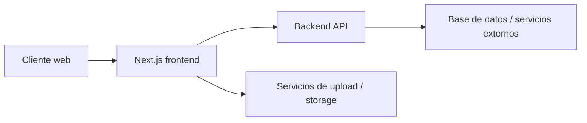

# 15 - Deployment

## Objetivo

Definir el contrato operativo para desplegar el frontend con seguridad, trazabilidad y validaciones minimas antes de habilitar nuevas funciones.

## Topologia esperada



## Entornos

| Entorno | Uso | Requisitos minimos |
| --- | --- | --- |
| Local | Desarrollo | Variables de entorno, backend alcanzable, storage accesible |
| QA / Staging | Validacion funcional | Misma configuracion de auth y permisos que produccion |
| Produccion | Operacion real | Secretos definitivos, monitoreo, smoke tests aprobados |

## Variables de entorno requeridas

| Variable | Uso | Clasificacion |
| --- | --- | --- |
| `NEXT_PUBLIC_API_URL` | URL del backend consumido por `apiFetch` y auth | Publica |
| `NEXT_PUBLIC_API_KEY` | Header requerido por backend y uploads | Publica |
| `AUTH_SECRET` | Firma de NextAuth | Secreta |

## Dependencias operativas

- Backend disponible y con CORS correcto.
- Endpoints de auth operativos:
  - `/auth/login`
  - `/rol-permisos/rol/:rol`
  - `/docentes/usuario/:userId` para flujo docente
- Endpoints de upload disponibles para CSV y archivos.
- Mismos permisos y nombres de roles entre frontend y backend.

## Comandos base

```bash
npm run dev
npm run build
npm run start
npm run lint
```

## Checklist previo al despliegue

- Variables de entorno definidas por ambiente.
- `AUTH_SECRET` no reutilizado entre apps no relacionadas.
- `NEXT_PUBLIC_API_URL` apunta al backend correcto del ambiente.
- Verificar que las rutas protegidas cargan permiso esperado.
- Verificar que login `DOCENTE` resuelve contexto completo.
- Verificar uploads:
  - constancias
  - pagos CSV
  - encuestas CSV
- Verificar sidebar por rol.

## Smoke tests posteriores al despliegue

1. Login como `SUPERADMIN`
2. Login como `ADMINISTRATIVO`
3. Login como `DOCENTE`
4. Navegar a:
   - `/usuarios`
   - `/estructura`
   - `/grupos`
   - `/perfil-docente/mis-resultados`
   - `/constancias`
   - `/examen-ubicacion`
5. Ejecutar al menos un upload no destructivo
6. Confirmar redirecciones de acceso denegado

## Riesgos de despliegue

- Si cambia el contrato del backend, varios modulos fallan simultaneamente.
- Si la API key publica deja de coincidir con backend, fallan datos y uploads.
- Si el secreto de auth cambia sin invalidacion controlada, las sesiones activas se rompen.
- Si el backend cambia nombres de roles o permisos, el sidebar y los guards pueden desalinearse.

## Rollback

- Mantener disponible la version anterior del frontend.
- Revertir solo despues de validar:
  - auth
  - permisos
  - modulo afectado
- Si el fallo es de contrato backend, priorizar feature flag o rollback coordinado.

## Observabilidad minima

- Logs del host del frontend
- Logs de login fallido y redirects por permiso
- Logs de backend para endpoints usados por auth y uploads
- Monitoreo de errores de red al backend

## Politica para cambios futuros

- Ningun cambio de contrato backend se despliega sin actualizar `docs/` y `specs/`.
- Ningun despliegue a produccion se considera listo sin smoke tests por rol.
- Cualquier nueva variable de entorno debe agregarse primero a esta guia.
