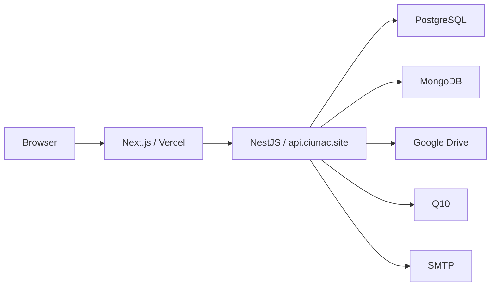
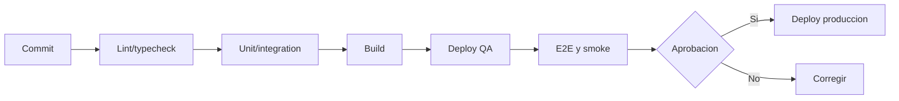

# 15 - Deployment

## Topologia

## Ambientes

| Ambiente | Objetivo | Datos |
| --- | --- | --- |
| Local | desarrollo | fixtures/no productivos |
| QA/Staging | aceptacion e integracion | datos sanitizados |
| Produccion | operacion CIUNAC | datos reales y auditoria |

## Configuracion frontend

- `NEXT_PUBLIC_API_URL`: publica.
- `NEXT_PUBLIC_API_KEY`: publica; no es secreto de usuario.
- `AUTH_SECRET`: secreto de NextAuth.
- `NEXT_PUBLIC_EXCEPTION_USER`: excepcion existente que debe auditarse antes de produccion.

## Configuracion backend

- PostgreSQL: host, port, user, password y database.
- MongoDB: URI.
- JWT: access secret.
- API Key del backend.
- Google OAuth/refresh token y carpetas Drive.
- Credenciales SMTP por tipo de correo.
- Credenciales Q10.
- CORS y habilitacion de Swagger por ambiente.

No se documentan valores secretos.

## Pipeline

## Orden de despliegue

1. Backup y migraciones compatibles.
2. Backend backward-compatible.
3. Smoke de API y guards.
4. Frontend.
5. Smoke por rol y flujo critico.
6. Retiro posterior de contratos obsoletos.

## Smoke tests

- Login de los tres roles.
- Permiso permitido y denegado.
- Contexto docente completo y ausente.
- Consulta de usuarios, estructura y grupos.
- Registro/listado de solicitud en ambiente controlado.
- Preview/upload no destructivo de documento.
- Examen y seguimiento docente.

## Rollback

- Mantener artefactos frontend/backend anteriores.
- Migraciones incluyen `down` o procedimiento probado.
- Evitar rollback backend si una migracion destructiva ya fue usada.
- Deshabilitar feature o revertir frontend cuando el contrato siga compatible.
- Registrar version, hora, responsable y motivo.

## Brechas

- `GAP-DEP-001`: CORS esta codificado en backend.
- `GAP-DEP-002`: no se encontro pipeline CI compartido en el frontend.
- `GAP-DEP-003`: propietario y plataforma exacta del backend no estan documentados.
- `GAP-DEP-004`: estrategia formal de migraciones y rollback requiere aprobacion operativa.
