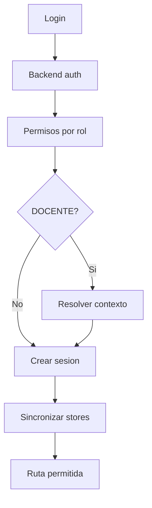

# Modulo Autenticacion - Spec

## Objetivo y actores

Autenticar `SUPERADMIN`, `ADMINISTRATIVO`, `MESADEPARTES` y `DOCENTE`, construir una sesion consistente y permitir solo rutas compatibles con rol, permisos y contexto docente.

## Historias

- `HU-AUTH-001`: iniciar sesion con credenciales validas.
- `HU-AUTH-002`: cerrar sesion y eliminar contexto persistido.
- `HU-AUTH-003`: recuperar contexto docente para experiencia personal.

## Reglas de negocio

- `RN-AUTH-001`: backend valida credenciales y emite token.
- `RN-AUTH-002`: `SUPERADMIN` tiene bypass frontend.
- `RN-AUTH-003`: otros roles cargan permisos desde rol-permisos.
- `RN-AUTH-004`: `DOCENTE` requiere `docenteId` y `perfilId` en rutas personales.
- `RN-AUTH-005`: Zustand es proyeccion UI; no concede autorizacion.
- `RN-AUTH-006`: `gestion_solicitudes` permite `SUPERADMIN` por bypass y exige rol `ADMINISTRATIVO` o `MESADEPARTES` mas permiso; cualquier otro rol se bloquea.

## Criterios de aceptacion

- `CA-AUTH-001`: sesion contiene token, usuario, rol y permisos.
- `CA-AUTH-002`: credenciales, permisos y contexto producen errores distintos.
- `CA-AUTH-003`: logout limpia NextAuth, auth store y docente store.
- `CA-AUTH-004`: manipular storage no permite una operacion backend.
- `CA-AUTH-005`: login y recarga conservan `MESADEPARTES` y sus permisos en sesion/store.

## UI

| Tipo | Inventario |
| --- | --- |
| Paginas/rutas | `/`, `/registro` |
| Componentes | `LoginForm`, `RegistroForm`, `Providers`, `ProtectedRoute` |
| Formularios | login y registro con RHF/Zod |
| Tablas/filtros | No aplica |
| Estado | NextAuth, `useAuthStore`, `useDocenteStore` |
| Permisos visibles | sidebar y rutas filtrados tras hidratar sesion |

## Endpoints y datos

- `POST /auth/login`, `POST /auth/register`, `POST /auth/logout`, `GET /auth/profile`.
- `GET /rol-permisos/rol/:rol`.
- `GET /docentes/usuario/:usuarioId`.
- Datos: usuario, rol, permisos, token, docente y perfil.

## Validaciones y errores

- Email valido, password minima y rol conocido.
- 401 credenciales; 403 permiso; contexto docente faltante; API/red; payload incompleto.
- `GAP`: `NEXT_PUBLIC_API_KEY` no es secreto y varios endpoints backend no validan JWT.

## Flujo

## Tareas tecnicas

Definidas en `tasks.md` como `TASK-AUTH-*`.

## Pruebas

Definidas en `tests.md` como `TEST-AUTH-*`.
