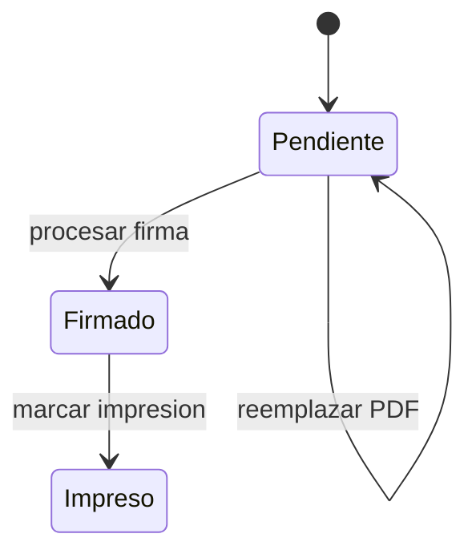

# Modulo Certificados - Spec

## Objetivo y actores

Emitir certificados asociados a solicitudes, gestionar notas, PDF, firma e impresion. `SUPERADMIN` opera `AS-IS`; acceso administrativo depende de `DECISION-001` y `gestion_certificados`.

## Historias

- `HU-CERT-001`: crear/editar certificado desde una solicitud.
- `HU-CERT-002`: generar o subir archivo PDF.
- `HU-CERT-003`: procesar firma y consultar estados.

## Reglas

- `RN-CERT-001`: certificado requiere `solicitudId` compatible.
- `RN-CERT-002`: notas pertenecen al certificado y no duplican ciclo funcional.
- `RN-CERT-003`: reemplazar archivo conserva identificadores necesarios para limpiar/versionar.
- `RN-CERT-004`: firma actualiza certificado y solicitud o compensa el fallo.

## Criterios

- `CA-CERT-001`: certificado valido se guarda con notas y solicitud.
- `CA-CERT-002`: PDF se previsualiza/sube y puede reintentarse sin duplicar.
- `CA-CERT-003`: firma cambia documento y solicitud consistentemente.
- `CA-CERT-004`: pendientes, firmados e impresos muestran solo registros correctos.

## UI

| Tipo | Inventario |
| --- | --- |
| Rutas | `/certificados`, `/{id}`, `/nuevo`, `/firmados`, `/impresos` |
| Componentes | `CertificadoForm`, notas table, PDF, upload, firma, reporte y error dialog |
| Formulario/schema | `certificado.form.tsx`, `certificado.schema.ts` |
| Tabla/filtro | `CertificadosTable`, filtro `busqueda`, acciones por estado |
| Estado | local de formulario/tabla; catalogos estructura |
| Permiso | `gestion_certificados`; ruta impresos no visible en sidebar (`GAP`) |

## API y datos

- CRUD y estados `/certificados/*`, archivo `POST /certificados/:id/archivo`, firma `PATCH /certificados/procesar-firma`, reporte `GET /certificadosr`.
- MongoDB `Certificado` y notas embebidas; enlace PostgreSQL `solicitudId`.

## Validaciones y errores

- Solicitud, numero de registro, estudiante/curso y notas validas.
- Solicitud ya asociada, archivo invalido, Drive, firma ausente, compensacion y estado incompatible.
- `GAP`: servicio frontend llama DELETE aunque el controlador inventariado no muestra DELETE para certificado.

## Tareas tecnicas

Definidas en `tasks.md` como `TASK-CERT-*`.

## Pruebas

Definidas en `tests.md` como `TEST-CERT-*`.
