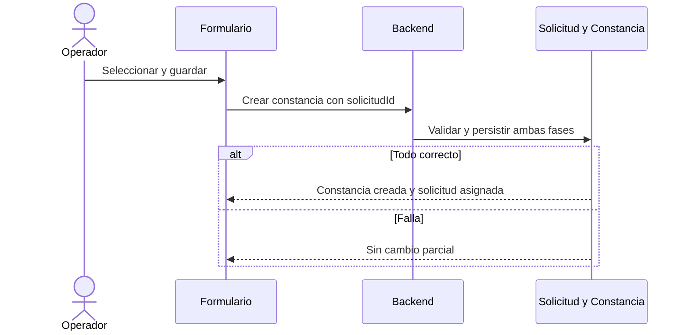

# Modulo Constancias - Spec

## Objetivo y actores

Emitir constancias de matricula o notas asociadas a solicitudes y gestionar PDF, firma, impresion y entrega. Acceso mediante `gestion_constancias`, sujeto a `DECISION-001`.

## Historias

- `HU-CONS-001`: seleccionar solicitud y crear constancia.
- `HU-CONS-002`: generar/subir PDF.
- `HU-CONS-003`: firmar, imprimir y entregar.

## Reglas

- `RN-CONS-001`: constancia requiere solicitud existente y compatible.
- `RN-CONS-002`: `MATRICULA` exige modalidad y horario.
- `RN-CONS-003`: `NOTAS` exige detalle academico coherente.
- `RN-CONS-004`: asignacion de solicitud y creacion deben ser atomicas o compensables.
- `RN-CONS-005`: firma actualiza constancia y solicitud a firmada.

## Criterios

- `CA-CONS-001`: constancia se crea y solicitud queda asignada solo despues de exito.
- `CA-CONS-002`: reglas condicionales bloquean datos incompletos.
- `CA-CONS-003`: PDF puede reintentarse sin duplicar archivo.
- `CA-CONS-004`: firma, impresion y entrega respetan orden y consistencia.

## UI

| Tipo | Inventario |
| --- | --- |
| Rutas | `/constancias`, `/{id}`, `/nueva`, `/firmadas`, `/entregadas` |
| Componentes | `ConstanciaForm`, asignar solicitud, detalle notas, PDF, tabla |
| Formulario/schema | `constancia.form.tsx`, `validation.schema.ts` |
| Tablas/filtros | constancias por estado, filtro estudiante; detalle filtro idioma |
| Estado | local + hook de listas; catalogos estructura |
| Permiso | `gestion_constancias` |

## API y datos

- CRUD `/constancias`, listas por estado, `PATCH /constancias/procesar-firma`, `POST /upload/constancias`.
- MongoDB `Constancia`/detalle; PostgreSQL `Solicitud` por `id_solicitud`.

## Error funcional confirmado

`AS-IS`: al seleccionar una solicitud, el frontend ejecuta `PATCH /solicitudes/:id { estadoId: 2 }`; despues el usuario guarda la constancia. Si cancela o falla la creacion, la solicitud queda asignada sin constancia. Crear constancia en backend no cambia la solicitud.

## Validaciones y errores

- Datos base, tipo, ciclo, solicitud, catalogos, modalidad/horario o detalle notas.
- Solicitud ya usada, Drive, PDF parcial, firma inexistente, estado invalido y compensacion.

## Tareas tecnicas

Definidas en `tasks.md` como `TASK-CONS-*`.

## Pruebas

Definidas en `tests.md` como `TEST-CONS-*`.
