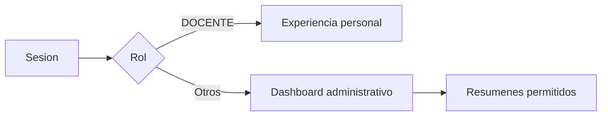

# Modulo Dashboard - Spec

## Objetivo y actores

Dar a cada usuario autenticado un punto de entrada seguro y comprensible, mostrando resumen administrativo o redirigiendo a la experiencia docente correspondiente.

## Historias y reglas

- `HU-DASH-001`: ver dashboard despues de login.
- `RN-DASH-001`: `/dashboard` requiere sesion.
- `RN-DASH-002`: `DOCENTE` debe priorizar sus resultados personales.
- `RN-DASH-003`: errores de permiso/contexto se muestran sin exponer datos.

## Criterios de aceptacion

- `CA-DASH-001`: usuario autenticado ve dashboard sin datos no autorizados.
- `CA-DASH-002`: query `unauthorized` o `missing-docente-context` produce mensaje util.
- `CA-DASH-003`: carga parcial de reportes no rompe toda la pagina.

## UI y datos

| Elemento | Contrato |
| --- | --- |
| Pagina/ruta | `/dashboard` |
| Componentes | cards, indicadores, breadcrumbs y sidebar |
| Formularios/tablas/filtros | No hay formulario principal; reportes pueden filtrar por datos disponibles |
| Estado | sesion, permisos, carga de reportes |
| API | reportes/tiempos y datos agregados usados por la pagina |
| Permiso | sesion; datos internos deben respetar permisos de origen |

## Validaciones y errores

- Query de error solo acepta codigos conocidos.
- Estados loading, partial, empty y unauthorized.
- `GAP`: el dashboard administrativo no tiene permiso granular documentado por widget.

## Tareas tecnicas

Definidas en `tasks.md` como `TASK-DASH-*`.

## Pruebas

Definidas en `tests.md` como `TEST-DASH-*`.
