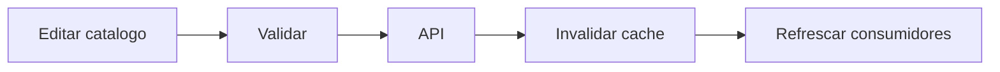

# Modulo Estructura - Spec

## Objetivo y actores

Administrar catalogos compartidos por grupos, solicitudes, documentos, examenes y seguimiento. Actores: `SUPERADMIN` y roles autorizados con `gestionar_estructura`.

## Historia y reglas

- `HU-ESTR-001`: mantener aulas, ciclos, idiomas, niveles, modulos/periodos y textos.
- `RN-ESTR-001`: IDs de catalogo son referencias, no el texto visible.
- `RN-ESTR-002`: ciclo relaciona idioma y nivel.
- `RN-ESTR-003`: modulos visibles alimentan selectores operativos.
- `RN-ESTR-004`: una mutacion invalida el cache correspondiente.

## Criterios

- `CA-ESTR-001`: CRUD se refleja en tabs y consumidores.
- `CA-ESTR-002`: referencias en uso no se eliminan sin control.
- `CA-ESTR-003`: cache no sirve datos obsoletos despues de editar.

## UI

| Tipo | Inventario |
| --- | --- |
| Ruta | `/estructura` |
| Componentes | tabs `op-aulas`, `op-ciclos`, `op-idiomas`, `op-niveles`, `op-periodos`, `op-textos` |
| Formularios | edicion inline |
| Tablas/filtros | datatables editables por catalogo |
| Estado | `useOpcionesStore` en sessionStorage |
| Permiso | `gestionar_estructura` |

## API y modelo

- CRUD `/aulas`, `/ciclos`, `/idiomas`, `/niveles`, `/modulos`, `/textos`.
- `GET /modulos/visibles`.
- Entidades TipoORM para catalogos; `Texto` en MongoDB.

## Validaciones y errores

- Nombre/codigo requerido; IDs relacionados existentes; fechas de modulo coherentes; visibilidad booleana.
- Duplicados, referencia en uso, cache obsoleto, API y permisos.
- `GAP`: tablas inline no comparten schema canonico.

## Tareas tecnicas

Definidas en `tasks.md` como `TASK-ESTR-*`.

## Pruebas

Definidas en `tests.md` como `TEST-ESTR-*`.
