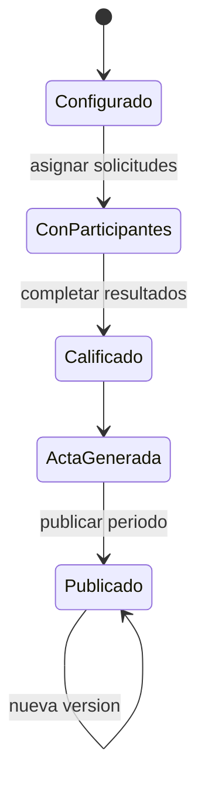

# Modulo Examen De Ubicacion - Spec

## Objetivo y actores

Configurar examenes, asignar solicitudes pagadas, calificar participantes, generar actas/constancias y publicar resultados por periodo e idioma. Acceso `AS-IS`: `SUPERADMIN`; otros roles dependen de `DECISION-001` y `examenes_ubicacion`.

## Historias

- `HU-EXU-001`: administrar examen y configuracion.
- `HU-EXU-002`: asignar, retirar y calificar participantes.
- `HU-EXU-003`: generar acta y constancia individual.
- `HU-EXU-004`: generar/publicar resultados agrupados por periodo e idioma.

## Reglas

- `RN-EXU-001`: examen requiere fecha, aula, docente, idioma, estado y codigo.
- `RN-EXU-002`: participante requiere solicitud compatible y no duplicada.
- `RN-EXU-003`: asignar cambia solicitud a asignada; retirar la devuelve a nueva; terminar la lleva a terminada.
- `RN-EXU-004`: calificacion y nivel resultante se resuelven con catalogos vigentes.
- `RN-EXU-005`: resultados publicados incluyen solo examenes de ubicacion del periodo e idiomas seleccionados.
- `RN-EXU-006`: publicacion registra version, responsable y fecha; regenerar no borra trazabilidad.

## Criterios

- `CA-EXU-001`: CRUD y configuracion validan referencias.
- `CA-EXU-002`: participante y solicitud cambian de forma consistente.
- `CA-EXU-003`: acta/constancia reflejan resultados terminados.
- `CA-EXU-004`: PDF consolidado agrupa idiomas sin mezclar periodos.
- `CA-EXU-005`: resultados incompletos bloquean o requieren confirmacion aprobada.
- `CA-EXU-006`: publicacion es versionada y descargable.

## UI

| Tipo | Inventario |
| --- | --- |
| Rutas | `/examen-ubicacion`, `/{id}`, `/nuevo`, `/participantes`, `/configuracion` |
| Componentes | tabla examenes, form, detalle, selector/tabla participantes, configuracion, acta/resultados/PDF |
| Formulario | `ExamenForm`; CRUD inline de cronograma/calificaciones |
| Tablas/filtros | examenes, participantes globales, participantes por examen; filtros por columnas/periodo |
| Estado | local + catalogos; no store propio |
| Permiso | `examenes_ubicacion` |

## API y modelo

- CRUD `/examenesubicacion`, `/detallesubicacion`, `/calificacionesubicacion`, `/cronogramaubicacion`, `/actasexamenubicacion`.
- PostgreSQL para examen/detalle/configuracion; MongoDB para acta.
- `TO-BE`: endpoints de generacion/publicacion por periodo con metadata versionada.

## Validaciones y errores

- Referencias activas, solicitud pagada, no duplicado, nota/rango/nivel coherente.
- Periodo sin examenes, participante incompleto, conflicto de estado, acta repetida, PDF/upload/publicacion.
- `GAP`: estados usan constantes locales numericas y guards backend son desiguales.

## Feature: publicacion de resultados

El usuario selecciona un periodo, el sistema filtra exclusivamente examenes de ubicacion, agrupa participantes terminados por idioma, valida integridad, genera preview institucional y publica una version auditable. Un periodo sin resultados no genera documento vacio.

## Tareas tecnicas

Definidas en `tasks.md` como `TASK-EXU-*`.

## Pruebas

Definidas en `tests.md` como `TEST-EXU-*`.
