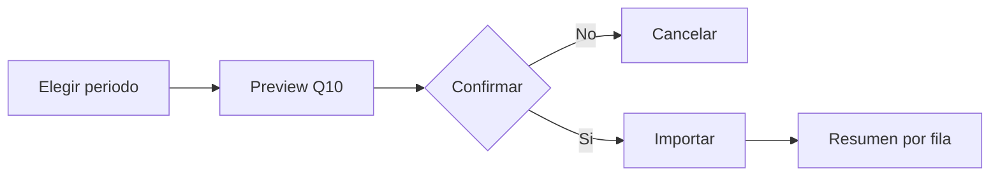

# Modulo Grupos - Spec

## Objetivo y actores

Gestionar grupos academicos manualmente o mediante importacion Q10. Actores: `SUPERADMIN` y usuarios con `gestionar_estructura`.

## Historia y reglas

- `HU-GRP-001`: listar, filtrar, crear y editar grupos.
- `HU-GRP-002`: importar horarios/cursos de un periodo Q10.
- `RN-GRP-001`: grupo requiere modulo, ciclo, codigo, docente, frecuencia y modalidad.
- `RN-GRP-002`: importacion exige periodo y debe ser repetible sin duplicar.

## Criterios

- `CA-GRP-001`: grupo valido aparece en tabla y detalle.
- `CA-GRP-002`: preview Q10 no persiste hasta confirmar.
- `CA-GRP-003`: importacion informa aceptados, rechazados y duplicados.

## UI, API y datos

| Tipo | Inventario |
| --- | --- |
| Rutas | `/grupos`, `/grupos/{id}`, `/grupos/nuevo`, `/grupos/importar` |
| Componentes | `GruposDataTable`, `GrupoForm`, `ImportarGrupos` |
| Formularios | grupo + schema; importacion + periodo |
| Tabla/filtro | grupos, columnas academicas y busqueda configurada |
| Estado | local + catalogos estructura |
| API | CRUD `/grupos`; GET/POST `/q10/horarios-cursos` |
| Datos | Grupo, Modulo, Ciclo, Docente, Aula, curso Q10 |

## Validaciones y errores

- IDs existentes, codigo no vacio, periodo requerido, modalidad/frecuencia validas.
- Q10 no disponible, respuesta invalida, duplicado, referencia inexistente y fila parcial.
- `GAP`: idempotencia de importacion no esta explicitada en contrato.

## Tareas tecnicas

Definidas en `tasks.md` como `TASK-GRP-*`.

## Pruebas

Definidas en `tests.md` como `TEST-GRP-*`.
