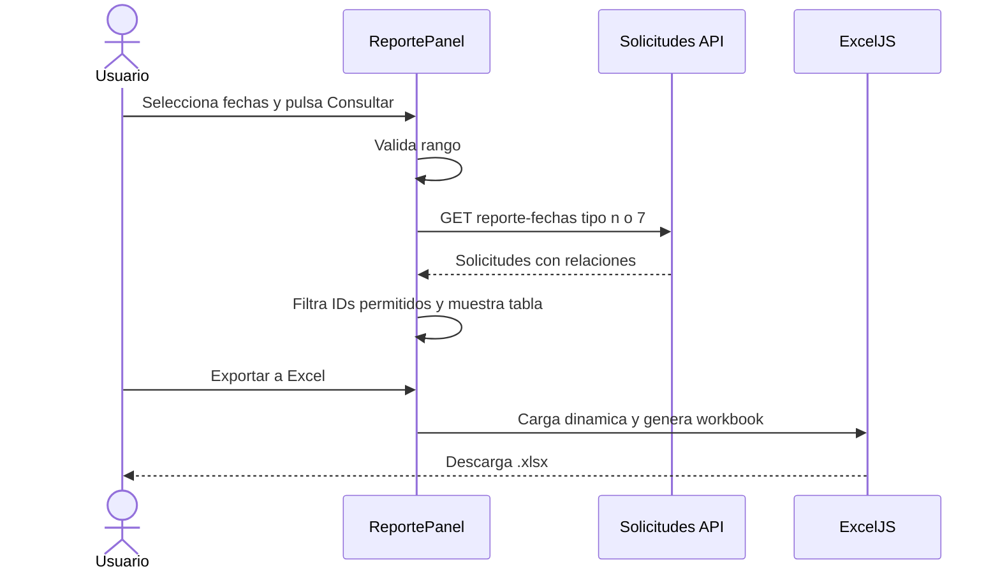

# Modulo Reportes - Spec

## Objetivo y actores

Consultar solicitudes por rango de fechas y exportar reportes operativos de documentos y examen de ubicacion. `SUPERADMIN` accede por bypass; cualquier otro rol requiere `importar_pagos` en su sesion.

## Historias

- `HU-REP-001`: consultar certificados y constancias creados en un periodo.
- `HU-REP-002`: consultar solicitudes de examen de ubicacion creadas en un periodo.
- `HU-REP-003`: exportar todos los resultados consultados a un archivo Excel utilizable por el area administrativa.
- `HU-REP-004`: revisar y exportar las observaciones registradas en cada solicitud.

## Reglas de negocio

- `RN-REP-001`: abrir la pagina no ejecuta una consulta; el usuario debe pulsar `Consultar`.
- `RN-REP-002`: el rango inicial va desde el primer dia del mes vigente hasta hoy en `America/Lima`.
- `RN-REP-003`: ambas fechas son inclusivas y el frontend no incrementa la fecha final.
- `RN-REP-004`: documentos consume `tipo=n` y conserva solo `tipoSolicitudId` entre `1` y `6`.
- `RN-REP-005`: examen consume `tipo=7` y conserva solo `tipoSolicitudId=7`.
- `RN-REP-006`: el Excel contiene todos los resultados consultados, no solo la pagina visible o el filtro de busqueda local.
- `RN-REP-007`: `/reportes` reutiliza `importar_pagos`; `SUPERADMIN` conserva su bypass.
- `RN-REP-008`: las observaciones se muestran en ambas tablas y se exportan completas, conservando sus saltos de linea.

## Criterios de aceptacion

- `CA-REP-001`: al abrir `/reportes` se muestran las fechas por defecto y ningun request de reporte.
- `CA-REP-002`: un rango valido muestra solo tipos `1..6` en Documentos y solo tipo `7` en Examen.
- `CA-REP-003`: rango vacio, invalido o invertido se rechaza antes de llamar al API.
- `CA-REP-004`: carga, vacio, error y resultados tienen estados visuales diferenciados.
- `CA-REP-005`: la tabla permite buscar, ordenar, paginar y cambiar visibilidad de columnas.
- `CA-REP-006`: la exportacion genera `.xlsx` con las columnas y el nombre definidos por tipo y periodo.
- `CA-REP-007`: sidebar y acceso directo respetan `importar_pagos` y el bypass de `SUPERADMIN`.
- `CA-REP-008`: la tabla permite buscar y ordenar por observaciones; el Excel contiene la columna completa entre Estado y Fecha de solicitud.
- `CA-REP-009`: los archivos de ambos reportes abren en Microsoft Excel sin solicitar recuperacion ni reparacion de contenido.

## UI, datos y API

| Area | Contrato |
| --- | --- |
| Pagina | `/reportes?reporte=documentos|examen` |
| Componentes | `ReportesWorkspace`, `ReportePanel`, `ReporteTable` |
| Formulario | fecha inicial, fecha final y boton `Consultar` |
| Tabla/filtro | `DataTable`, busqueda compuesta incluida observacion, ordenamiento y paginacion local |
| Estado | local por pestaña; no usa store global |
| API | `GET /solicitudes/reporte-fechas?inicio=YYYY-MM-DD&fin=YYYY-MM-DD&tipo=n|7` |
| Datos | `Solicitud.observaciones`, `Estudiante`, `TipoSolicitud`, `Idioma`, `Nivel`, `Estado` |
| Exportacion | ExcelJS cargado dinamicamente en el navegador |

## Validaciones y errores

- Fechas requeridas, formato calendario valido e `inicio <= fin`.
- Valores relacionados ausentes se muestran como `-` y se exportan como celda vacia.
- `observaciones` nula, ausente, vacia o compuesta solo por espacios se muestra como `-` y se exporta vacia.
- `400` indica contrato rechazado; `401` sesion/API Key; `403` permiso; red o `5xx` permiten reintentar.
- `GAP-REP-001`: el backend devuelve `tipo=n`; el aislamiento de documentos `1..6` se realiza solo en frontend.
- `GAP-REP-002`: el endpoint permanece protegido unicamente por API Key y el permiso frontend no autoriza realmente el API.
- `GAP-REP-003`: ExcelJS 4.4.0 arrastra advisories transitivos en `archiver/brace-expansion` y `uuid`; no se aplica el downgrade incompatible sugerido por npm.

## Tareas y pruebas

Las tareas tecnicas estan en `tasks.md` y los escenarios en `tests.md`.
