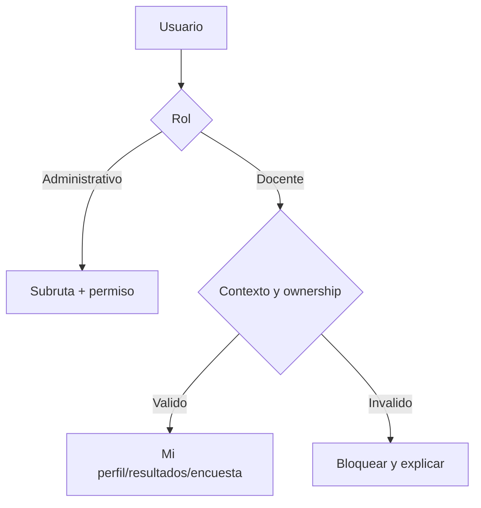

# Modulo Seguimiento Docente - Spec

## Objetivo y actores

Gestionar docentes, perfiles, documentos, cumplimiento, encuestas, ranking y catalogos; ofrecer a `DOCENTE` vistas personales limitadas a su contexto. Actores: `SUPERADMIN`, `ADMINISTRATIVO` con permisos especificos y `DOCENTE` con permisos personales.

## Historias

- `HU-SDOC-001`: administrar docentes y perfiles.
- `HU-SDOC-002`: gestionar documentos y cumplimiento.
- `HU-SDOC-003`: importar/configurar encuestas y consultar metricas.
- `HU-SDOC-004`: consultar ranking y detalle.
- `HU-SDOC-005`: consultar mi perfil, resultados y encuestas.

## Reglas

- `RN-SDOC-001`: usuario docente se vincula mediante `/docentes/usuario/:usuarioId`.
- `RN-SDOC-002`: perfil pertenece a docente e idioma.
- `RN-SDOC-003`: documento pertenece a perfil y tipo de documento.
- `RN-SDOC-004`: metricas/resultados se consultan en el mismo `moduloId`.
- `RN-SDOC-005`: vistas personales requieren `docenteId` y `perfilId` de sesion y ownership backend.
- `RN-SDOC-006`: CSV de encuestas valida columnas antes de persistir.

## Criterios

- `CA-SDOC-001`: CRUD docente/perfil/documento mantiene relaciones.
- `CA-SDOC-002`: dashboard, cumplimiento y ranking usan modulo seleccionado.
- `CA-SDOC-003`: importacion reporta filas y metricas consultables.
- `CA-SDOC-004`: docente ve solo sus datos.
- `CA-SDOC-005`: contexto parcial bloquea vistas personales con mensaje.
- `CA-SDOC-006`: acciones administrativas respetan permiso de subruta.

## UI

| Subflujo | Rutas/componentes |
| --- | --- |
| Dashboard | `/perfil-docente`, indicadores y pilares |
| Docentes | `/docentes`, `/nuevo`, `/{id}`, tabla/form/schema/store |
| Perfiles/documentos | `/documentos`, `/nuevo`, `/{id}`, forms/schemas/tables |
| Cumplimiento | `/academico-administrativo`, tabs de rubros |
| Encuestas | `/encuestas`, `/{id}`, `/preguntas`, `/importar`, `/mi-encuesta` |
| Ranking | `/ranking-docentes`, `/{id}`, tabla, graficos y detalle |
| Personal | `/mi-perfil`, `/mis-resultados`, `/mi-encuesta` |
| Opciones | `/opciones`, catalogos docentes |

## Formularios, tablas, filtros y estado

- Forms/schemas de docente, perfil y documento; importacion CSV.
- Tablas de docentes, perfiles, preguntas, respuestas, metricas y ranking.
- Filtros por docente, modulo y campos de tabla.
- `useDocenteStore` en localStorage y `usePerfilOpcionesStore` en sessionStorage.
- Permisos por subruta definidos en `lib/access-control.ts`.

## API y datos

- `/docentes`, `/perfil-docente`, `/documentos-docente`, `/dashboard-docentes`.
- `/encuesta-*`, `/perfil-docente-resultados`, `/cumplimiento-docente`.
- `/tipos-documento-perfil`, `/academico-administrativo`, `/puntaje-academico-administrativo`.
- PostgreSQL: docentes, perfiles, documentos, encuestas, cumplimiento y resultados.

## Validaciones y errores

- IDs de docente/perfil/modulo, ownership, schema de forms, CSV y catalogos.
- Sin contexto, perfil inexistente, modulo sin datos, CSV parcial, permiso y endpoint sin guard.
- `GAP`: varios controladores no declaran guard; servicios incluyen `any`; store puede desincronizarse.

## Tareas tecnicas

Definidas en `tasks.md` como `TASK-SDOC-*`.

## Pruebas

Definidas en `tests.md` como `TEST-SDOC-*`.
