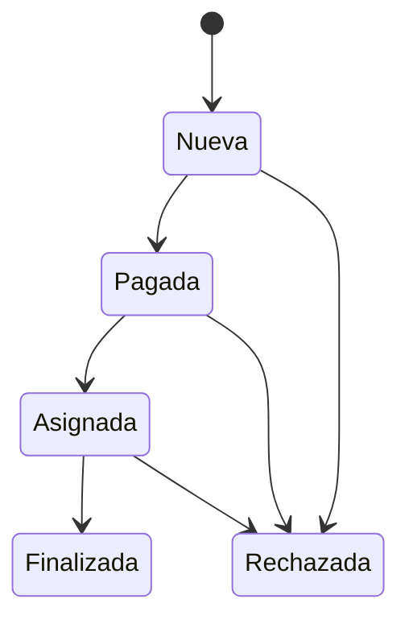

# Modulo Solicitudes - Spec

## Objetivo y actores

Registrar y gestionar solicitudes de beca, certificado, constancia y examen de ubicacion, incluyendo estudiantes, pagos y transiciones de estado. Para `gestion_solicitudes`, los actores son `SUPERADMIN`, `ADMINISTRATIVO` y `MESADEPARTES` segun la matriz aprobada.

## Historias

- `HU-SOL-001`: registrar solicitud manual y estudiante.
- `HU-SOL-002`: consultar por tipo y estado.
- `HU-SOL-003`: editar, observar o rechazar.
- `HU-SOL-004`: importar y reverificar pagos.

## Reglas

- `RN-SOL-001`: estudiante se reutiliza por documento cuando existe.
- `RN-SOL-002`: tipo, estado, idioma y nivel provienen de catalogos.
- `RN-SOL-003`: transiciones deben estar permitidas por flujo.
- `RN-SOL-004`: rechazo conserva motivo; no equivale a delete fisico.
- `RN-SOL-005`: pago solo cambia solicitudes compatibles.
- `RN-SOL-006`: `SUPERADMIN` accede por bypass; `ADMINISTRATIVO` y `MESADEPARTES` requieren `gestion_solicitudes`; `DOCENTE` y roles desconocidos se bloquean.
- `RN-SOL-007`: `gestion_becas` e `importar_pagos` no se heredan de `gestion_solicitudes`.

## Criterios

- `CA-SOL-001`: alta crea/reutiliza estudiante y solicitud sin duplicacion.
- `CA-SOL-002`: tabs/listas contienen solo tipo y estado solicitado.
- `CA-SOL-003`: edicion/rechazo actualiza y refresca vista.
- `CA-SOL-004`: CSV entrega resumen y no corrompe solicitudes ya procesadas.
- `CA-SOL-005`: las cuatro opciones asociadas a `gestion_solicitudes` son visibles y navegables solo para los actores autorizados por `RN-SOL-006`.

## UI

| Area | Rutas/componentes |
| --- | --- |
| Alta | `/solicitudes/nueva`, `NuevaSolicitudForm`, student/pago/solicitud fields |
| Becas | `/solicitudes/becas`, `/{id}`, tabla y detalle propios |
| Certificados | `/solicitudes/certificados`, `/{id}`, tabla/estado/detalle compartidos |
| Constancias | `/solicitudes/constancias`, `/{id}` |
| Ubicacion | `/solicitudes/ubicacion`, `/{id}` |
| Pagos | `/solicitudes/importar-pagos`, `ImportarPagos` |
| Tablas/filtros | filtro de tabla, tabs por estado, acciones editar/rechazar |
| Estado | formularios, tablas y catalogos; sin store propio |
| Permisos visibles | `gestion_solicitudes` cubre alta, certificados, constancias y ubicacion; becas y pagos conservan permisos propios |

## API y datos

- `/solicitudes/*`, `/solicitudbecas/*`, `/estudiantes/*`, `/pagos-banco/*`, `/upload/*`.
- Solicitud, Estudiante, TipoSolicitud, Estado, PagoBanco y SolicitudBeca.

## Validaciones y errores

- Documento, nombres, tipo, estado, montos/fecha/voucher y catalogos.
- Duplicado, transicion invalida, CSV parcial, estudiante inconsistente, pago ya aplicado.
- `GAP`: aliases/IDs de estados no son canonicos y `/solicitudes` no tiene pagina indice.

## Tareas tecnicas

Definidas en `tasks.md` como `TASK-SOL-*`.

## Pruebas

Definidas en `tests.md` como `TEST-SOL-*`.
