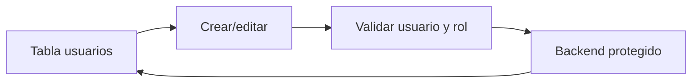

# Modulo Usuarios - Spec

## Objetivo y actores

Gestionar cuentas y roles. Actor principal: `SUPERADMIN`; otros roles solo si la matriz aprobada concede `gestionar_usuarios`.

## Historia y reglas

- `HU-USR-001`: listar, filtrar, crear, editar y eliminar usuarios.
- `RN-USR-001`: email identifica la cuenta y debe ser valido.
- `RN-USR-002`: rol debe existir y permisos se resuelven por backend.
- `RN-USR-003`: password solo se envia cuando el flujo la requiere.

## Criterios

- `CA-USR-001`: tabla filtra por email y refleja CRUD exitoso.
- `CA-USR-002`: alta usa `/auth/register` con validacion.
- `CA-USR-003`: usuario sin permiso no ve pagina ni opera endpoint.

## UI, API y datos

| Elemento | Inventario |
| --- | --- |
| Ruta | `/usuarios` |
| Tabla/filtro | `UsuariosDataTable`, filtro `email` |
| Formulario | edicion inline/dialog segun tabla; registro compartido |
| Estado | local de tabla + auth session |
| Endpoints | `/usuarios`, `/usuarios/:id`, `/auth/register`, `/rol-permisos/*` |
| Datos | Usuario, rol, rol-permiso |
| Permiso | `gestionar_usuarios` |

## Validaciones y errores

- Email, rol, password de alta, IDs y proteccion de cuenta critica.
- Duplicado, rol inexistente, ultimo superadmin, sesion propia y backend.
- `GAP`: no esta documentada regla para eliminar al usuario actual o ultimo superadmin.

## Tareas tecnicas

Definidas en `tasks.md` como `TASK-USR-*`.

## Pruebas

Definidas en `tests.md` como `TEST-USR-*`.
